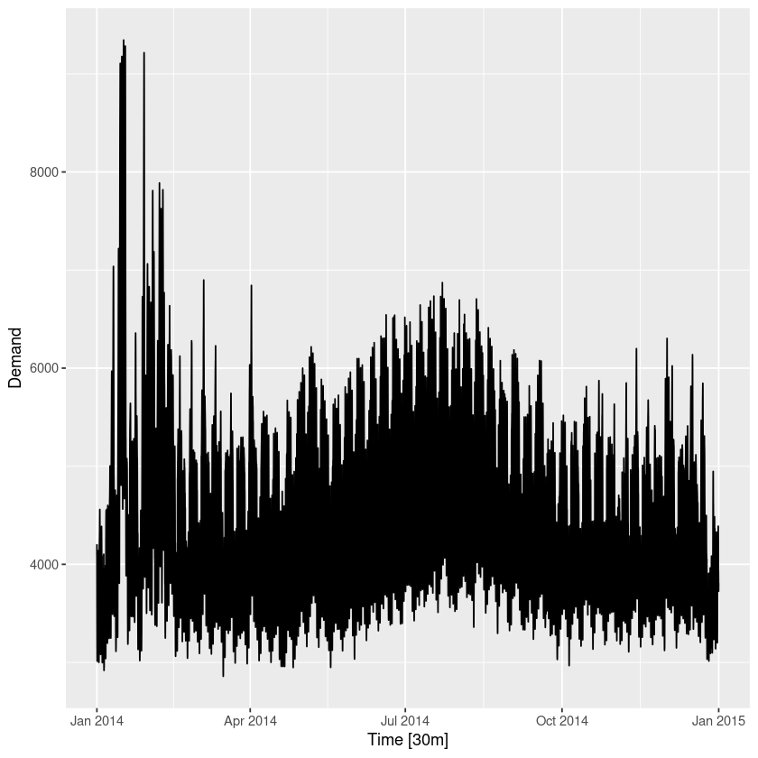
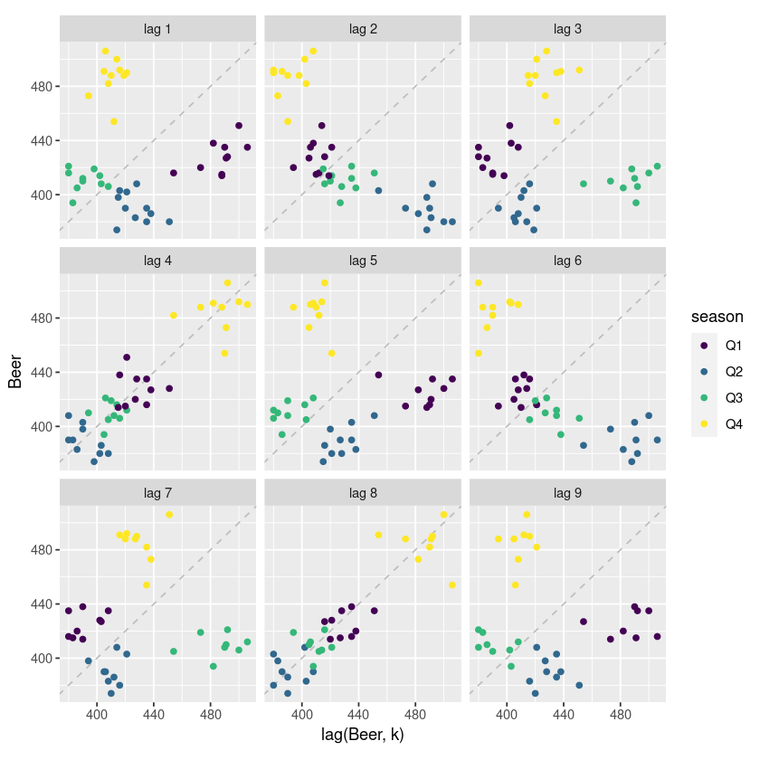
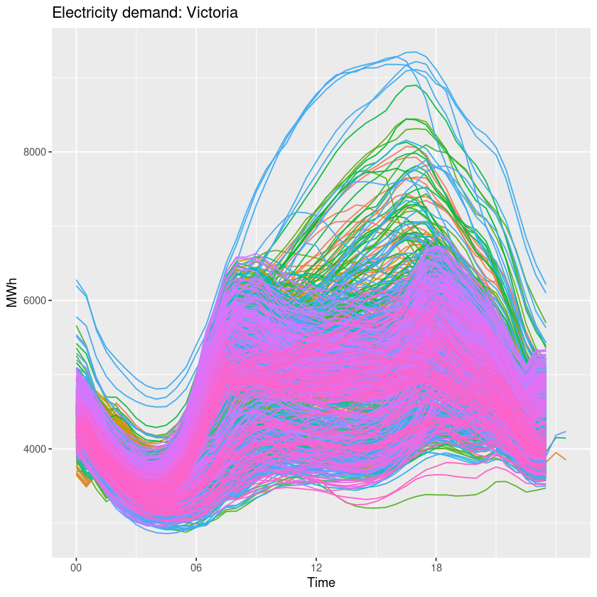
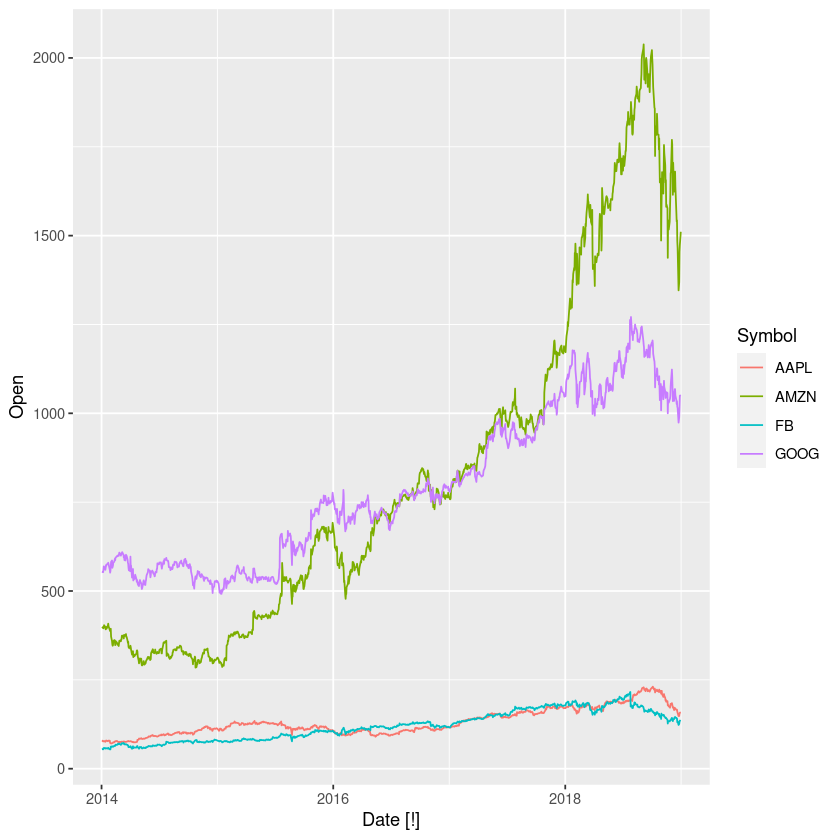

`install.packages("fpp3")`


```R
library("fpp3")
library("readr") #for loading csv
library("jsonlite") #for loading json

```

    ── Attaching packages ──────────────────────────────────────────────────────────────────────────────────────────────── fpp3 0.4.0 ──
    
    ✔ tibble      3.1.6     ✔ tsibble     1.1.1
    ✔ dplyr       1.0.7     ✔ tsibbledata 0.3.0
    ✔ tidyr       1.1.4     ✔ feasts      0.2.2
    ✔ lubridate   1.8.0     ✔ fable       0.3.1
    ✔ ggplot2     3.3.5     
    
    ── Conflicts ───────────────────────────────────────────────────────────────────────────────────────────────────── fpp3_conflicts ──
    ✖ lubridate::date()    masks base::date()
    ✖ dplyr::filter()      masks stats::filter()
    ✖ tsibble::intersect() masks base::intersect()
    ✖ tsibble::interval()  masks lubridate::interval()
    ✖ dplyr::lag()         masks stats::lag()
    ✖ tsibble::setdiff()   masks base::setdiff()
    ✖ tsibble::union()     masks base::union()
    


## Load Data


```R
prison <- readr::read_csv("https://OTexts.com/fpp3/extrafiles/prison_population.csv")
```

    Rows: 3072 Columns: 6
    
    ── Column specification ────────────────────────────────────────────────────────────────────────────────────────────────────────────
    Delimiter: ","
    chr  (4): State, Gender, Legal, Indigenous
    dbl  (1): Count
    date (1): Date
    
    
    ℹ Use `spec()` to retrieve the full column specification for this data.
    ℹ Specify the column types or set `show_col_types = FALSE` to quiet this message.
    


# Timeseries are tsibble

`2015:2019` means inclusive [2015,2019]


```R
y <- tsibble(
    Year = 2015:2019,
    Observation = c(1,2,3,4,5),
    index = Year,
    )
    
```


```R
y
```


<table class="dataframe">
<caption>A tbl_ts: 5 × 2</caption>
<thead>
	<tr><th scope=col>Year</th><th scope=col>Observation</th></tr>
	<tr><th scope=col>&lt;int&gt;</th><th scope=col>&lt;dbl&gt;</th></tr>
</thead>
<tbody>
	<tr><td>2015</td><td>1</td></tr>
	<tr><td>2016</td><td>2</td></tr>
	<tr><td>2017</td><td>3</td></tr>
	<tr><td>2018</td><td>4</td></tr>
	<tr><td>2019</td><td>5</td></tr>
</tbody>
</table>


## Convert Dataframe to tsibble


```R

```

# Pipes %>%


```R
y %>% 
    mutate(Year = Year+10) %>%
    mutate (Observation = Observation+2)

```


<table class="dataframe">
<caption>A tbl_ts: 5 × 2</caption>
<thead>
	<tr><th scope=col>Year</th><th scope=col>Observation</th></tr>
	<tr><th scope=col>&lt;dbl&gt;</th><th scope=col>&lt;dbl&gt;</th></tr>
</thead>
<tbody>
	<tr><td>2025</td><td>3</td></tr>
	<tr><td>2026</td><td>4</td></tr>
	<tr><td>2027</td><td>5</td></tr>
	<tr><td>2028</td><td>6</td></tr>
	<tr><td>2029</td><td>7</td></tr>
</tbody>
</table>


# Select Filter Mutate


```R
PBS %>%
    head
```


<table class="dataframe">
<caption>A tbl_ts: 6 × 9</caption>
<thead>
	<tr><th scope=col>Month</th><th scope=col>Concession</th><th scope=col>Type</th><th scope=col>ATC1</th><th scope=col>ATC1_desc</th><th scope=col>ATC2</th><th scope=col>ATC2_desc</th><th scope=col>Scripts</th><th scope=col>Cost</th></tr>
	<tr><th scope=col>&lt;mth&gt;</th><th scope=col>&lt;chr&gt;</th><th scope=col>&lt;chr&gt;</th><th scope=col>&lt;chr&gt;</th><th scope=col>&lt;chr&gt;</th><th scope=col>&lt;chr&gt;</th><th scope=col>&lt;chr&gt;</th><th scope=col>&lt;dbl&gt;</th><th scope=col>&lt;dbl&gt;</th></tr>
</thead>
<tbody>
	<tr><td>1991 Jul</td><td>Concessional</td><td>Co-payments</td><td>A</td><td>Alimentary tract and metabolism</td><td>A01</td><td>STOMATOLOGICAL PREPARATIONS</td><td>18228</td><td>67877</td></tr>
	<tr><td>1991 Aug</td><td>Concessional</td><td>Co-payments</td><td>A</td><td>Alimentary tract and metabolism</td><td>A01</td><td>STOMATOLOGICAL PREPARATIONS</td><td>15327</td><td>57011</td></tr>
	<tr><td>1991 Sep</td><td>Concessional</td><td>Co-payments</td><td>A</td><td>Alimentary tract and metabolism</td><td>A01</td><td>STOMATOLOGICAL PREPARATIONS</td><td>14775</td><td>55020</td></tr>
	<tr><td>1991 Oct</td><td>Concessional</td><td>Co-payments</td><td>A</td><td>Alimentary tract and metabolism</td><td>A01</td><td>STOMATOLOGICAL PREPARATIONS</td><td>15380</td><td>57222</td></tr>
	<tr><td>1991 Nov</td><td>Concessional</td><td>Co-payments</td><td>A</td><td>Alimentary tract and metabolism</td><td>A01</td><td>STOMATOLOGICAL PREPARATIONS</td><td>14371</td><td>52120</td></tr>
	<tr><td>1991 Dec</td><td>Concessional</td><td>Co-payments</td><td>A</td><td>Alimentary tract and metabolism</td><td>A01</td><td>STOMATOLOGICAL PREPARATIONS</td><td>15028</td><td>54299</td></tr>
</tbody>
</table>


```R
PBS %>%
    filter(ATC2 == "A10") %>%
    select(Month, Concession, ATC2, Cost) %>%
    head
```


<table class="dataframe">
<caption>A tbl_ts: 6 × 6</caption>
<thead>
	<tr><th scope=col>Month</th><th scope=col>Concession</th><th scope=col>ATC2</th><th scope=col>Cost</th><th scope=col>Type</th><th scope=col>ATC1</th></tr>
	<tr><th scope=col>&lt;mth&gt;</th><th scope=col>&lt;chr&gt;</th><th scope=col>&lt;chr&gt;</th><th scope=col>&lt;dbl&gt;</th><th scope=col>&lt;chr&gt;</th><th scope=col>&lt;chr&gt;</th></tr>
</thead>
<tbody>
	<tr><td>1991 Jul</td><td>Concessional</td><td>A10</td><td>2092878</td><td>Co-payments</td><td>A</td></tr>
	<tr><td>1991 Aug</td><td>Concessional</td><td>A10</td><td>1795733</td><td>Co-payments</td><td>A</td></tr>
	<tr><td>1991 Sep</td><td>Concessional</td><td>A10</td><td>1777231</td><td>Co-payments</td><td>A</td></tr>
	<tr><td>1991 Oct</td><td>Concessional</td><td>A10</td><td>1848507</td><td>Co-payments</td><td>A</td></tr>
	<tr><td>1991 Nov</td><td>Concessional</td><td>A10</td><td>1686458</td><td>Co-payments</td><td>A</td></tr>
	<tr><td>1991 Dec</td><td>Concessional</td><td>A10</td><td>1843079</td><td>Co-payments</td><td>A</td></tr>
</tbody>
</table>


## autoplot

| Plots Type | Code |
| ---  | -------  |
| Scatter | `ggplot(aes(x = Temperature, y = Demand)) +geom_point()`|


```R
head(vic_elec)
```


<table class="dataframe">
<caption>A tbl_ts: 6 × 5</caption>
<thead>
	<tr><th scope=col>Time</th><th scope=col>Demand</th><th scope=col>Temperature</th><th scope=col>Date</th><th scope=col>Holiday</th></tr>
	<tr><th scope=col>&lt;dttm&gt;</th><th scope=col>&lt;dbl&gt;</th><th scope=col>&lt;dbl&gt;</th><th scope=col>&lt;date&gt;</th><th scope=col>&lt;lgl&gt;</th></tr>
</thead>
<tbody>
	<tr><td>2012-01-01 00:00:00</td><td>4382.825</td><td>21.40</td><td>2012-01-01</td><td>TRUE</td></tr>
	<tr><td>2012-01-01 00:30:00</td><td>4263.366</td><td>21.05</td><td>2012-01-01</td><td>TRUE</td></tr>
	<tr><td>2012-01-01 01:00:00</td><td>4048.966</td><td>20.70</td><td>2012-01-01</td><td>TRUE</td></tr>
	<tr><td>2012-01-01 01:30:00</td><td>3877.563</td><td>20.55</td><td>2012-01-01</td><td>TRUE</td></tr>
	<tr><td>2012-01-01 02:00:00</td><td>4036.230</td><td>20.40</td><td>2012-01-01</td><td>TRUE</td></tr>
	<tr><td>2012-01-01 02:30:00</td><td>3865.597</td><td>20.25</td><td>2012-01-01</td><td>TRUE</td></tr>
</tbody>
</table>


```R
vic_elec %>%
    filter(year(Time)==2014) %>%
    autoplot(Demand)
```


    

    


```R
vic_elec %>%
    head
```


<table class="dataframe">
<caption>A tbl_ts: 6 × 5</caption>
<thead>
	<tr><th scope=col>Time</th><th scope=col>Demand</th><th scope=col>Temperature</th><th scope=col>Date</th><th scope=col>Holiday</th></tr>
	<tr><th scope=col>&lt;dttm&gt;</th><th scope=col>&lt;dbl&gt;</th><th scope=col>&lt;dbl&gt;</th><th scope=col>&lt;date&gt;</th><th scope=col>&lt;lgl&gt;</th></tr>
</thead>
<tbody>
	<tr><td>2012-01-01 00:00:00</td><td>4382.825</td><td>21.40</td><td>2012-01-01</td><td>TRUE</td></tr>
	<tr><td>2012-01-01 00:30:00</td><td>4263.366</td><td>21.05</td><td>2012-01-01</td><td>TRUE</td></tr>
	<tr><td>2012-01-01 01:00:00</td><td>4048.966</td><td>20.70</td><td>2012-01-01</td><td>TRUE</td></tr>
	<tr><td>2012-01-01 01:30:00</td><td>3877.563</td><td>20.55</td><td>2012-01-01</td><td>TRUE</td></tr>
	<tr><td>2012-01-01 02:00:00</td><td>4036.230</td><td>20.40</td><td>2012-01-01</td><td>TRUE</td></tr>
	<tr><td>2012-01-01 02:30:00</td><td>3865.597</td><td>20.25</td><td>2012-01-01</td><td>TRUE</td></tr>
</tbody>
</table>


## Seasonal Plot
Plots a single year on the x-axis to see patterns by months/seasons.


## Correlation

$$r = \frac{\sum (x_{t} - \bar{x})(y_{t}-\bar{y})}{\sqrt{\sum(x_{t}-\bar{x})^2}\sqrt{\sum(y_{t}-\bar{y})^2}}$$

$r$ lies [-1,1]


```R
recent_production <- aus_production %>%
  filter(year(Quarter) >= 2000)
recent_production %>%
  gg_lag(Beer, geom = "point") +
  labs(x = "lag(Beer, k)")
```


    

    


```R
vic_elec %>% gg_season(Demand, period = "day") +
  theme(legend.position = "none") +
  labs(y="MWh", title="Electricity demand: Victoria")
```


    

    


```R

```

    
    Attaching package: ‘zoo’
    
    
    The following object is masked from ‘package:tsibble’:
    
        index
    
    
    The following objects are masked from ‘package:base’:
    
        as.Date, as.Date.numeric
    
    


```R
gafa_stock %>%
    autoplot()
```

    Plot variable not specified, automatically selected `.vars = Open`
    


    

    


```R
head(gafa_stock)
```


<table class="dataframe">
<caption>A tbl_ts: 6 × 8</caption>
<thead>
	<tr><th scope=col>Symbol</th><th scope=col>Date</th><th scope=col>Open</th><th scope=col>High</th><th scope=col>Low</th><th scope=col>Close</th><th scope=col>Adj_Close</th><th scope=col>Volume</th></tr>
	<tr><th scope=col>&lt;chr&gt;</th><th scope=col>&lt;date&gt;</th><th scope=col>&lt;dbl&gt;</th><th scope=col>&lt;dbl&gt;</th><th scope=col>&lt;dbl&gt;</th><th scope=col>&lt;dbl&gt;</th><th scope=col>&lt;dbl&gt;</th><th scope=col>&lt;dbl&gt;</th></tr>
</thead>
<tbody>
	<tr><td>AAPL</td><td>2014-01-02</td><td>79.38286</td><td>79.57571</td><td>78.86000</td><td>79.01857</td><td>66.96433</td><td> 58671200</td></tr>
	<tr><td>AAPL</td><td>2014-01-03</td><td>78.98000</td><td>79.10000</td><td>77.20428</td><td>77.28286</td><td>65.49342</td><td> 98116900</td></tr>
	<tr><td>AAPL</td><td>2014-01-06</td><td>76.77857</td><td>78.11429</td><td>76.22857</td><td>77.70428</td><td>65.85053</td><td>103152700</td></tr>
	<tr><td>AAPL</td><td>2014-01-07</td><td>77.76000</td><td>77.99429</td><td>76.84571</td><td>77.14857</td><td>65.37959</td><td> 79302300</td></tr>
	<tr><td>AAPL</td><td>2014-01-08</td><td>76.97285</td><td>77.93714</td><td>76.95571</td><td>77.63715</td><td>65.79363</td><td> 64632400</td></tr>
	<tr><td>AAPL</td><td>2014-01-09</td><td>78.11429</td><td>78.12286</td><td>76.47857</td><td>76.64571</td><td>64.95345</td><td> 69787200</td></tr>
</tbody>
</table>


```R
dgoog <- gafa_stock %>%
  filter(Symbol == "GOOG", year(Date) >= 2018) %>%
  mutate(trading_day = row_number()) %>%
  update_tsibble(index = trading_day, regular = TRUE) %>%
  mutate(diff = difference(Close))
```


```R
dgoog %>%
    difference(close, differences = 2)
```


    Error in lag < 1: comparison (3) is possible only for atomic and list types
    Traceback:


    1. dgoog %>% difference(close, differences = 2)

    2. difference(., close, differences = 2)


```R

```
