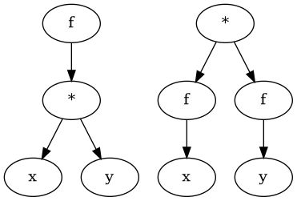

# Linear or Cauchy pattern

# Functions and differentials

$$ A \mapsto B $$
$$ \delta A \overset{?}{\mapsto} \delta B $$

* When we think of maps we should also think about change.

# Division as mapping

$$\frac{A::Miles}{B::inches}$$
$$ B::inches \mapsto A::Miles $$

* One can think of division as a map. How B inches maps to A Miles.

# Division as normalization

* Beta in finance, Variance of AAPL maps to Covariance of (AAPL,SPX)
  * We can think of the denominator as a normalization variable
  * Beta tells us how much AAPL is affected by the SPX. The division normalizes AKA removes the AAPL variance from the (AAPL,SPX) covariance.

# logic and Negated quantifier

* Expanding quantifiers 
  * $\forall x \in A, x \in B$
  * $\forall x (x \in A \rightarrow x \in B)$
  * $\forall x (x \notin A \lor x \in B)$
* Negating quantifiers 
  * $\lnot (\forall x \in A, x \in B)$ 
  * $\lnot (\forall x (x \notin A  \lor \in B))$ 
  * $\exists x \lnot (x \notin A \lor x \in B)$
  * $\exists x (x \in A \land x \notin B)$
  * $\exists x \in A, x \notin B$ 

## Sets

* Sets to logic notation
  * $Bleh = \{ x \in U| Even(x) \land Hah(x)\}$
  * $\forall x \in U( x \in Bleh \leftrightarrow Even(x) \land Hah(x))$

# CS bridge math

* Quantum mechanics is functional analysis which uses infinite-dimensional linear algebra and real analysis
* Quantum circuits are described by unitary operators on a Hilbert space
  * Hilbert space is vector space with an inner product which makes it metrically complete under the norm induced by that inner product. 
  * Hilbert spaces allow us to use linear algebra and real analysis.
* Error correcting code, coding theory uses finite linear algebra
* PageRank is fundamentally a problem of computing approximations to eigenvectors of a linear map on a vector space with a basis consisting of all the pages on the web
* computable functions between types is, if not the same, then at least extremely similar to the study of continuous maps between topological spaces
* monoids from abstract algebra is highly important to (if not just another way of looking at) the theory of formal languages. You've probably heard of regular expressions. Well, the languages of strings described by regular expressions are exactly those languages which are the preimage under a monoid homomorphism of a subset of a finite monoid in a free monoid. Understanding some things about monoids, through that lets us figure out things about regular languages (for one)
* Order theory is important to the theory of semantics of programming languages and recursion theory, where types of values are given definedness orderings which make them into directed-complete partial orders. (This shines through especially well in non-strict functional programming languages like Haskell, where people use the language of 'bottom' to refer to nonterminating computations -- a completely undefined value being at the bottom of the order.)
* Generalising the theory of monoids and order theory at the same time, you have category theory, 