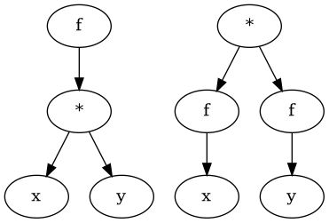

# Linear or Cauchy pattern

# Functions and differentials

$$ A \mapsto B $$
$$ \delta A \overset{?}{mapsto} \delta B $$

* When we think of maps we should also think about change.

# Division as mapping

$$\fraction{A::Miles}{B::inches}$$
$$ B::inches \mapsto A::Miles $$

* One can think of division as a map. How B inches maps to A Miles.

# Division as normalization

* Beta in finance, Variance of AAPL maps to Covariance of (AAPL,SPX)
  * We can think of the denominator as a normalization variable
  * Beta tells us how much AAPL is affected by the SPX. The division normalizes AKA removes the AAPL variance from the (AAPL,SPX) covariance.
