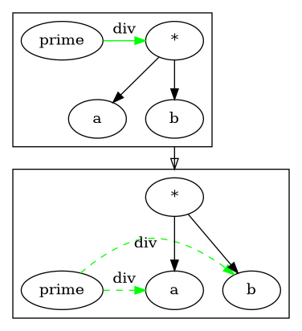

```plantuml
@startuml
digraph G {
compound=true

  subgraph clustera{
    
    {rank=same; a; b;p}
    a 
    b
    c [label="*"]
    p [label="prime"]
    c -> a
    c -> b
    p -> a [color=green style="dashed" label="div"]
    p -> b [color=green style="dashed" label="div"]
    }
    subgraph clusterb{
        {rank=same; c1; p1}
    a1 [label="a"]
    b1 [label="b"]
    c1 [label="*"]
    p1 [label="prime"]
    c1 -> a1
    c1 -> b1
    p1 -> c1 [color=green label="div"]
    }
    b1 -> c [arrowhead=empty ltail=clusterb lhead=clustera]
} 
@enduml
```

Euclid Lemma: If prime p divides a * b then p divides either a or b.