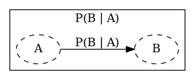
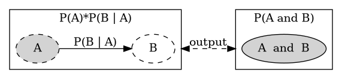

[Probability playground](http://www.acsu.buffalo.edu/~adamcunn/probability/probability.html)


# Logic Analogy

$$P(B | A) \cdot P(A) = P(A \land B)$$

Logically the greatest fix point

$$ A \Rightarrow B, A \vdash A \land B $$


| $P(B | A)$ | $P(A)$ |$=$ |  $P(A \land B)$ |
| --- | --- | --- | --- |
| $A \Rightarrow B$ | $A$ | $\vdash$ | $A \land B$ |

# Developer Analogy
One can see conditional probabilities in terms of **states**  

1. State 1: $P(A)$ [prior]
2. State 2: $P(A | B)$
3. State 3: $P(A | B C)$
4. State 4. $P(A | B C ...)$


We call State 1 our **prior** and the   
conditional probability or final state **post-erior**


# Conditional Probability and statistical Alpha

http://www.columbia.edu/~cjd11/charles_dimaggio/DIRE/styled-4/code-12/


Eg. We run a t-test between 2 sample populations. This returns 2 normal curves with one mean 0, and the other delta representing the **DIFFERENCE between populations**.  
WARNING: **The normal curves DO NOT represent each of the 2 sample populations**

* Type 1 or alpha: P(t-test tells us there is difference | Reality there is no difference)
* Type 2 or beta: P(t-test tells us there is no difference | Reality there is a difference)
* Power or (1-beta): P(t-test tells us there is a difference | Reality there is a difference)
# My Interpretation


* Shaded node $P(A)$ behaves like **existential intro**

```plantuml
@startuml
digraph G {
  rankdir = LR
compound=true

	subgraph cluster_1 {
		node [style=""];
		label = "P(A)";
		A [label="A" style=filled];
   
	}

}
@enduml
```



* $P(A | B)$ shows a relation between **partitions** of A and B.
  * Behaves like function or **Implication** that is only activated when an object A is given.



* $P(A)P(A | B)$ merges the partitions A and B together.



# Misconceptions

**Multiplying 2 priors $P(A)P(B)$ typically is a dead end.**  
**We need the conditional probability to understand the relationship between 2 priors**

$$P(A)P(B) \neq P(A\land B)$$

```plantuml
@startuml
digraph G {
  rankdir = LR
compound=true

	subgraph cluster_1 {
		
		node [style=""];
		label = "WRONG";
             subgraph cluster_2 {
				 
		  style="filled,rounded"
                  label = "P(A and C)"
                  C [style="none"]
                  A [label="A" style=dashed];

                }
    B [label="B" style="dashed"];
    A -> B [label = "P(B | A)"];
	}

}
@enduml
```

We cannot Overshoot the prior condition of the conditional probability.  
Example is fueling $P(B|A)$ with $P(A \land C)$ which overshoots the condition of requiring only $P(A)$. WRONG!


# Another logic example

$$P(B|A)P(A) + P(B| \lnot A)P(\lnot A)$$
$$ (A \land B) \lor (A \land \lnot B) \vdash A $$

## Chain rule

$$\begin{aligned} P(A \land B \land C \land D) &= P(A | B \land C \land D) \cdot P(B \land C \land D) \\ &= P(A | B \land C \land D) \cdot P(B | C \land D) \cdot P(C \land D) \\ &= P(A | B \land C \land D) \cdot P(B | C \land D) \cdot P(C | D) \cdot P(D) \end{aligned}$$


> All nodes are called priors. The bridge between nodes are called conditional probabilites.

Question: We want to know what the probability that a set of events happen simultaneously. Given that we know all possible transitions or conditionals. 
Answer: 
Say we have n nodes(events).
Partition n nodes to 1 and [...n-1] nodes. We can find the P(n) = P(A| ...n-1)P(...n-1)  
What if we don't know the probability of the [...n-1] nodes,  
PARTITION n-1 nodes to 1 and [...n-2] nodes. ...

Know this is only easy if we know all the conditional probabilities before hand.


Prove $P(A | B \land C ) \cdot P(B | C) = P(B | A \land C) \cdot P(A | C)$