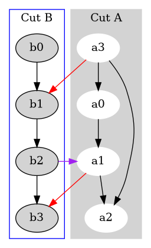
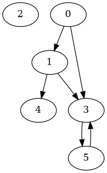

# Cuts

Analogous to the partitions of set. 
In fact, when forming possible cuts, only the elements of the set matter.  


* Cut : a partition of the NODES of a graph, NOT the edges.
* Cut-Set: The boundary edges that connects these two cuts or partitions. 
  * Elements of the cut-set are edges that exist in both Cuts bridging one cut to the other cut.
  * In directed graph Cut-Set(A,B) only counts edge with tail in A and head in B.


$$Cut_A= \{a0,a1,a2,a3\}$$
$$Cut_B=\{b0,b1,b2,b3\}$$

---


# Undirected Graph 

```plantuml
digraph G {
   
    
  subgraph cluster_0 {
    style=filled;
    color=lightgrey;
    node [style=filled,color=white];
    a0 -> a1 -> a2 [arrowhead=none];
    a3 -> a2 [arrowhead=none]; 
    label = "Cut A";
  }

  subgraph cluster_1 {
    node [style=filled];
    b0 -> b1 -> b2 -> b3 [arrowhead=none];
    label = "Cut B";
    color=blue
  }
  a3 -> b1 [arrowhead=none color=red];
  a1 -> b3 [arrowhead=none color=red];
  b2 -> a1 [arrowhead=none color=red];
  a3 -> a0 [arrowhead=none];


}
```


$$\text{Cut-Set(A,B) = Cut-Set(B,A)}$$

$${\color{red}\text{Cut-Set(A,B)}}=\{e \in edges\ |\ e\ is\ {\color{red}RED}\}$$


---

# Directed Graph


$${\color{red}\text{Cut-Set(A,B)}}=\{e \in edges\ |\ e\ is\ {\color{red}RED}\}$$

$${\color{purple}\text{Cut-Set(B,A)}}=\{e \in edges\ |\ e\ is\ {\color{purple}PURPLE}\}$$

---

* Cut with n vertices $\Rightarrow 2^n$ cuts 
  * 2 = Either choose a vertex to be in a partition or don't choose it
  * The Powerset of a set of nodes

* Minimum Cuts
  * Minimize number elements in the Cut-Set
  * Most efficient way to divide a network assuming equal weight


# MST

Obviously to Span a tree, one must choose at least 1 edge of a Cut-Set.

* Choosing an edge to a cut-set = Union of 2 partitions

The minimum element in a Cut-Set is the edge contained in all MST.  


## BFS

### Adjacency list




```python

a = [[1,3],[3,4],[2],[5],[],[3]]

b =  [[0 for col in range(0,len(a))] for row in range(0,len(a))]

class Node:
    def __init__(self,data):
        self.children = []
        self.data = data
    def printout(self):
        print(self.data)


def adjToMat(adj,mat):
    for row,adjlist in enumerate(adj):
        for col in adjlist:
           mat[row][col] = 1 
    return mat

c = adjToMat(a,b)

def prettyMat(x):
    colLabel = "  ".join([str(i) for i in range(0,len(x))])
    print(f"   {colLabel}")
    for row,i in enumerate(x):
        print(f"{row} {i}")
prettyMat(c)

#    0  1  2  3  4  5
# 0 [0, 1, 0, 1, 0, 0]
# 1 [0, 0, 0, 1, 1, 0]
# 2 [0, 0, 1, 0, 0, 0]
# 3 [0, 0, 0, 0, 0, 1]
# 4 [0, 0, 0, 0, 0, 0]
# 5 [0, 0, 0, 1, 0, 0]
```
