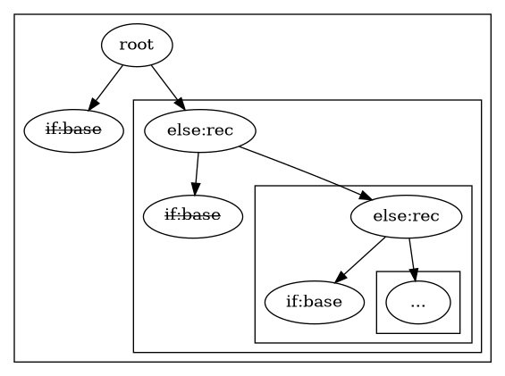
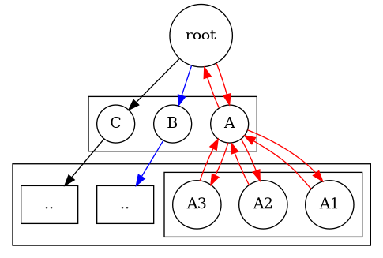
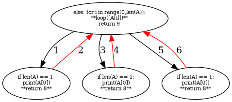

> if:base node will only be used at a leaf node.

```python
def listprint(A,s,e):
    if s == e+1:
        return
    else:
        print(A[s]) #prints at each recursive stack
        return listprint(A,s+1,e)
print(listprint([2,3,4],0,2))
```

```python
def listprint(A,s,e):
    s = s
    e = e
    while s != e+1:
        print(A[s])
        s = s+1
    return
print(listprint([2,3,4],0,2))
```

# Recursion tree

Moving downwards is recursive call  
Moving horizontally is iterative loops  

Precedence: Downwards > Horizontal  
Recursive calls take priority over Iterative loops  
Recursive calls are naturally DFS  


# Examples

## return

```python
def loop(A):
    if len(A) == 1:
        print(A[0])
        return 8
    else:
        for i in range(0,len(A)):
            return loop([A[i]]) #BAD: EARLY REWIND 
        return 9
loop([2,3,4])
#>print 2
#>return 8
```
```python
def loop(A):
    if len(A) == 1:
        print(A[0])
        return 8 
    else:
        for i in range(0,len(A)):
            loop([A[i]]) #8 from leafnode .. does nothing
        return 9 
loop([2,3,4])
#>print 2 3 4
#>return 9
```
The loop doesn't work properly when we add a return statement. Why?   
Rather than DFS, it will hit the first deepest leaf it finds then returns back up to the root.  



## lazy recursion doesnt work

```python
def fact(x):
    if x == 1:
        return 1
    else:
        return lambda: x*fact(x-1)
print(fact(5)())
#>Error cant multiply 'int' with 'lambda'
#>fact :: () -> int
```

Possible alternative, an tail-recursive version

```python
def fact(x,a):
    if x == 1:
        return a
    else:
        return lambda: fact(x-1,x*a)
print(fact(5,1)()()()())
```

```python
def fact(x):
    if x == 1:
        return [1]
    else:
        return [x,fact(x-1)]
#>[5, [4, [3, [2, [1]]]]]
```


