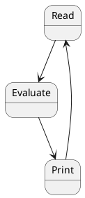

```python
def REPL():
    x = input() #READ
    y = eval(x) #EVAL
    print(y)    #PRINT
    REPL()      #LOOP

```
---

### Tokenizer

Tokenizing is simply the act of converting a string to a list of elements.

---

### A Very Simple LISP math eval for AST

* Racket treats list like (+ 2 3) as AST.
  * Head of list is the operator.  
  * Tail of list are the arguments 

```python
def helperStr_Int(k):
    try:
        return int(k)
    except:
        return k

str_to_OP={"+": lambda x,y: x+y}

def eval_naive(AST):
    operator = str_to_OP[AST[0]]
    args = list(map(lambda x: helperStr_Int(x),AST[1:]))
    return operator(*args)

test = ["+","2","3"]

eval_naive(["+","2","3"])
```

### Eval with nested AST
```python
str_to_OP={"+": lambda x,y: x+y,
           "define": lambda x:3}

def helperStr_Int(k):
    try:
        return int(k)
    except:
        return k

def eval_naive(AST):
    operator = str_to_OP[AST[0]]
    args = list(map(lambda x: helperStr_Int(x) ,AST[1:]))
    RECURSEargs = list(map(lambda x: eval_naive(x) if isinstance(x,list) else x, args))
    #Recursively calls eval if another AST is found in the args.
    return operator(*RECURSEargs)

eval_naive(["+",["+","1","2"],"3"])
```

---

### Using Lambdas to define a local environment

In lambda calculus we can think of everything as a lambdas, everything including the local environment.

$(\lambda x. sourceCode)(2) \Rightarrow sourceCode[2/variable]$   
```python
x=2
###sourceCode
if(..):
  doSomething(x)
  y=x*..
.....
###sourceCode
```  

We can't do this naively in python because python does eager evaluation.  

A way to get around that is converting everything to string then using `eval`{.python} which simulates a lazy evaluation.


```python
#wrapCode builds our lazy lambda expression string
def wrapCode(sourceCode,var,val):
    return f"(lambda {var}: {sourceCode})({val})"

wrapCode(wrapCode("print(x+y)","x",2),"y",3)
#> '(lambda y: (lambda x: print(x+y))(2))(3)'

eval(wrapCode(wrapCode("print(x+y)","x",2),"y",3))
#> 5
```

---

```haskell
data Expr = Var String
          | Const Int
          | Plus Expr Expr
          | Times Expr Expr
          | Sin Expr
          | Cos Expr
          deriving Show

diff :: Expr -> String -> Expr
diff (Var y) x | y == x = Const 1
               | otherwise = Const 0
diff (Const _) _ = Const 0
diff (Plus e1 e2) x = Plus (diff e1 x) (diff e2 x)
diff (Times e1 e2) x = Plus (Times (diff e1 x) e2)
                            (Times (diff e2 x) e1)
diff (Sin e1) x = Times (Cos e1) (diff e1 x)
diff (Cos e1) x = Times (Times (Const (-1)) (Sin e1)) (diff e1 x)
```

# Tokenizer


Tokenize a math expression  
eg. "-2 * 4" => ["-2", "*", "4"]

```python
isspace = lambda k : k == ' ' or k == '\t'

def is_number(k):
    try:
        float(k)
        return True
    except ValueError:
        return False

def token_single(x):
    if len(x) == 0:
        return []
    elif len(x) == 1:
        return [x]
    elif isspace(x[0]):
        return token_single(x[1:])
    elif x[0].isdigit() or x[0] == '-':
        if x[0].isdigit() and isspace(x[1]):
            return [x[0]] + token_multi(x[2:])
        else:
            t = token_multi(x[1:])
            if t == []:
                return [x[0]]
            else:
                if is_number(t[0]):
                    t[0] = x[0] + t[0]
                    return t
                else:
                    return [x[0]] + t
    else:
        if x[0] == '(':
            t = token_single(x[1:])
        else:
            t = token_multi(x[1:])
        return [x[0]] + t

def token_multi(x):
    if len(x) == 0:
        return []
    elif len(x) == 1:
        return [x]
    elif isspace(x[0]):
        return token_multi(x[1:])
    elif x[0].isdigit():
        if isspace(x[1]):
            return [x[0]] + token_multi(x[2:])
        else:
            t = token_multi(x[1:])
            if t == []:
                return [x[0]]
            else:
                if is_number(t[0]):
                    t[0] = x[0] + t[0]
                    return t
                else:
                    return [x[0]] + t
    else:
        if x[0] == '(':
            t = token_single(x[1:])
        else:
            t = token_multi(x[1:])
        return [x[0]] + t

token_multi('-2')
```
