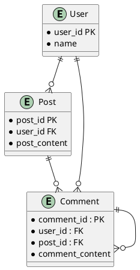

# Post-Comment-Subcomment

```plantuml
@startuml
entity User {
  * user_id PK
  * name
}

entity Post {
  * post_id PK
  * user_id FK
  * post_content
}
entity Comment {
  * comment_id : PK
  * user_id : FK
  * post_id : FK
  * comment_content
}

User ||--o{ Post
Post ||--o{ Comment
User ||--o{ Comment
Comment ||--o{ Comment
@enduml
```