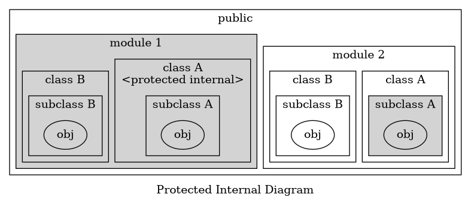
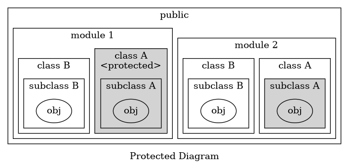
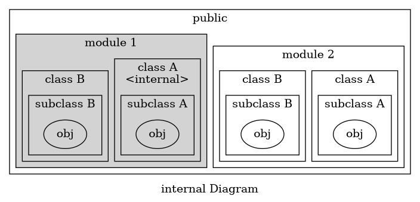
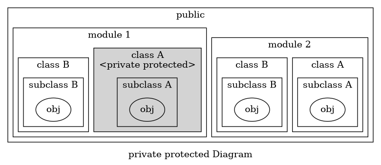
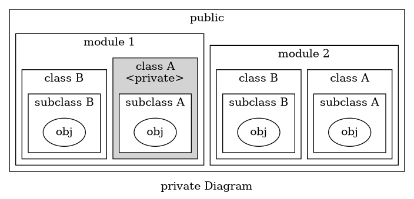

* Encapsulation - Use Settings and Getters
  * prevents accessing nulls 
* Inheritance - subclasses
* Abstraction+Polymorphism
    * Abstraction - interfaces and abstract classes
    * reduce conceptual complexity
    * Polymorphism - Allows us to use common method in Abstraction

module in C# are called "assembly"

| C# | Java |
| -- | -- |
| internal | no-modifier(default or package-private)   |
| public | public |
| private | private |
| internal protected | protected |
| protected | NA |

---

# C# Access modifiers

## protected internal

protected in Java

---

## protected

N/A in Java

---

## internal

no-modifier(default or package-private) in Java

---

## private protected

N/A in Java

---

## private

private in Java 

---

# Value-type vs Reference-type

* Value-type are literals
* Reference-type are objects like lists

