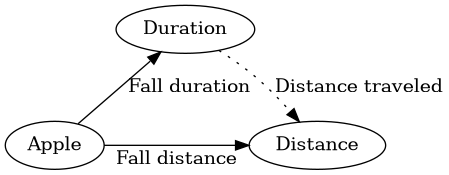
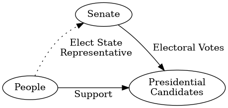
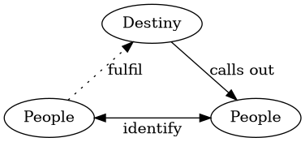
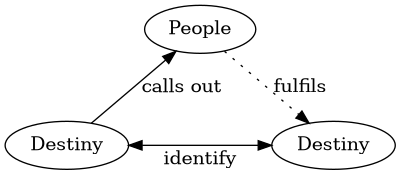

# Function, Fibre , Preimage

* Fibre is just a preimage of a single element.
* Another way to think of function is wrt to it's output .
  * The output elmeent is a representative of it's preimage.
   * The image are the representative elmeents that partitions the domain into preimages.
* eg. Congruence modulo n can be represented this way.
The output is the representative elmeent. The preimage is the set of elements in the equivalence class  of the represntative element. 

# Choice vs Determination


The subset of (distances) of (Falling Apples) in terms of (distance fallen function)
is RESTRICTED by
the subset of (durations) that a (falling apple) in terms of (duration of the fall).

Analogy OO properties:

* Falling Applies has 2 properties of type duration and type distance.
 * The 2 properties are determined by 2 functions,  
 "fall duration" :: Duration, and "distance fallen" :: Distance
 * The functions adds meaning to the types or in other words describes the subset of the types.

Our "Apple" object has 2 properties, how do these properties relate to each other?





--- 
## Section and Retraction

We will find the Section and Retraction wrt.

```plantuml
digraph G {
rankdir = LR
Destiny -> People [label="calls out"]
}
```

### Section


Destiny calling out

There are many possible Destinies that calls out to the same person but only one of such destiny is fulfilled.
Every person has their own destiny and their destiny also calls out to them. 

Every person represents a unique group of destinies. [calls out]
Every person can only fulfil one destiny from said group of destinies. [fulfil, injective]

The section for "calls out" function is the "fulfil" function.
Notice this section must be injective.

Generalize Section is a CHoice problem   
 
Every "Person" represents a "Group"
The section of such representation means Each "Person" much select one object of said "Group". 


### Retraction



retraction for "calls out" is the fulfil function.
Every person must be the representative of some group of Destinies. [calls out]


