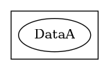
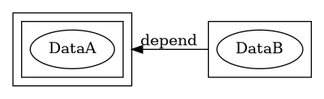
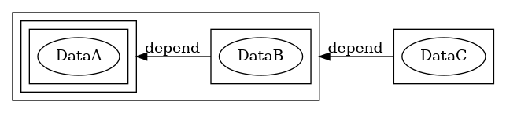

# Diagrams

## Chain(A) = [A]



---

## Chain(B) = [[A]] + [B]



---

## Chain(C) = [[[A]] + [B]] + [C] 



---

# Analysis

_ + A = (_,A)

* Chain(A) = 
* Chain(B) = 
* Chain(C) = 

## General Form


$$ Chain(N) = [Chain(N-1)] + [N] $$

Analogous to [Set theoretical natural numbers](/posts/2018-08-23-BuildNatSets.html)   
  $$ N = \{N-1\} \cup Pred(N) $$
  $$ N = Set(Pred(N)) + Pred(N)

```bash
Set(Expand(A)) = Expand(Set(A)) = A
A Union B = Set(Expand(A) + Expand(B))
Expand({{2}}) = {2}
N = Set(n-1) Union (n-1)
N = Set( Expand(Set(n-1)) + Expand(n-1) ) = Set((n-1) + Expand(n-1))
```

## Example node

Example data of the nth node of the chain:

* n-text
* n-timestamp
* n-index
* HASH of: 
  * n-text
  * n-timestamp
  * n-index
  * HASH(PREVIOUS-CHAIN)


PERSONAL-DATA = {n-text,n-timestamp,n-index}  
CURRENT-NODE = PERSONAL-DATA + HASH(PERSONAL-DATA,HASH(PREVIOUS-CHAIN))  
F = lambda x: x + HASH(x,y)  
P(N) + F(Pred(N))  

Adversary tampers with the the PERSONAL-DATA of the CURRENT-NODE with EVIL-PERSONAL-DATA. 


# Adversarial Attack

## Making fake transactions

The adversary(receiver) is to forge a fake transaction.  
Won't work because the private-key is linked to the identity of the (sender).  
Imagine if the adversary(receiver) did fake a transaction from the victim(sender), anyone could tell it was fake by taking the victim(sender) public key to verify the signature. 


## Doubling transaction

Example. Say we have a chain [Block Genesis...Block P, Block Q]  
An adversary wants to modify Block Q BUT to do so he must 

```python
import hashlib
import datetime

class MinimalBlock():
    def __init__(self, index, timestamp, data, previous_hash):
        self.index = index
        self.timestamp = timestamp
        self.data = data
        self.previous_hash = previous_hash
        self.hash = self.hashing()

    def hashing(self):
        key = hashlib.sha256()
        encodeUTF8 = lambda x: str(x).encode("utf-8")
        data = encodeUTF8(self.index +
                          self.timestamp +
                          self.data +
                          self.previous_hash)
        key.update(str(self.index).encode('utf-8'))
        key.update(str(self.timestamp).encode('utf-8'))
        key.update(str(self.data).encode('utf-8'))
        key.update(str(self.previous_hash).encode('utf-8'))
        return key.hexdigest()


class MinimalChain():
    def __init__(self): # initialize when creating a chain
        self.blocks = [self.get_genesis_block()]
    
    def get_genesis_block(self): 
        return MinimalBlock(0, 
                            datetime.datetime.utcnow(), 
                            'Genesis', 
                            'arbitrary')
    
    def add_block(self, data):
        self.blocks.append(MinimalBlock(len(self.blocks), 
                                        datetime.datetime.utcnow(), 
                                        data, 
                                        self.blocks[len(self.blocks)-1].hash))
    
    def get_chain_size(self): # exclude genesis block
        return len(self.blocks)-1
    
    def verify(self, verbose=True): 
        flag = True
        for i in range(1,len(self.blocks)):
            if self.blocks[i].index != i:
                flag = False
                if verbose:
                    print(f'Wrong block index at block {i}.')
            if self.blocks[i-1].hash != self.blocks[i].previous_hash:
                flag = False
                if verbose:
                    print(f'Wrong previous hash at block {i}.')
            if self.blocks[i].hash != self.blocks[i].hashing():
                flag = False
                if verbose:
                    print(f'Wrong hash at block {i}.')
            if self.blocks[i-1].timestamp >= self.blocks[i].timestamp:
                flag = False
                if verbose:
                    print(f'Backdating at block {i}.')
        return flag
    
    def fork(self, head='latest'):
        if head in ['latest', 'whole', 'all']:
            return copy.deepcopy(self) # deepcopy since they are mutable
        else:
            c = copy.deepcopy(self)
            c.blocks = c.blocks[0:head+1]
            return c
    
    def get_root(self, chain_2):
        min_chain_size = min(self.get_chain_size(), chain_2.get_chain_size())
        for i in range(1,min_chain_size+1):
            if self.blocks[i] != chain_2.blocks[i]:
                return self.fork(i-1)
        return self.fork(min_chain_size)

```

