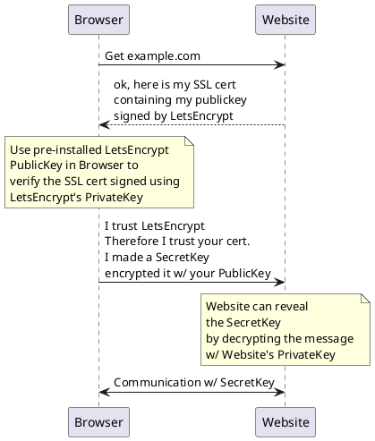
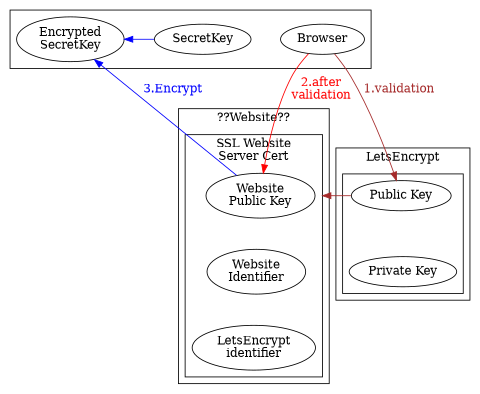
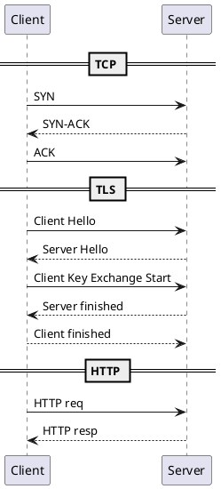

# HTTP vs HTTPS

* HTTP  : HTTP ----------------- TCP -- IP -- Ethernet  
* HTTPS:HTTP -- TLS(SSL) -- TCP -- IP -- Ethernet

HTTPS linked terms: SSL, Root Authority, Certificate Authority, TLS, 443

# HTTPS Certificate Authority

## Cert confirm identity

> Certificate Authorities validate the identity of the certificate holder(website) for the user(browser)

We want to talk to a website but how do we are not talking to a faker?  
A website needs to confirm it's identity using a Cert.   
But how do we know to trust the Cert?  
Using Certificate Authorities(CA) like LetsEncrypt



## Cert Signing Request

  * CA public key is pre-installed in most Client browsers
  * CA private key: Every month you may ask let's encrypt to sign your SSL Cert.

  Example CA: LetsEncrypt


Generates a public-private key pair as `domain.key`{.bash}   
and a Certificate Signing Request `domain.csr`{.bash}

```bash
openssl req -newkey rsa:2048 -nodes -keyout domain.key -out domain.csr
```

```plantuml
@startuml
digraph G {
  size="7"
compound=true
 subgraph cluster_0{
  label="Website"
   subgraph cluster_0a{
     label = ""
     A [label="Private Key"]
     B [label="Public Key"]
   }
   K [label="Real-life identity\nValidation" constraint=false] 
   

   
   }
A->Dia [color=blue fontcolor=blue label="1.CSR" ltail=cluster_0a constraint=false]
K->Dia [color=blue ltail=cluster_0a ]

Dia->DGC [color=red ] 
Dia [color=blue fontcolor=blue label = "CSR" shape="diamond"]
 subgraph cluster_1{
  label="LetsEncrypt"
DGC [label = "Digital Cert\nGeneration" color=red fontcolor=red shape="diamond"]
C -> DGC [color=red fontcolor=red label="2.signs"];

   subgraph cluster_1a{
     label = ""
     C [label="Private Key"]
     D [label="Public Key"]
   }
   
 
}
DGC -> E [ color=red lhead=cluster_1b]
subgraph cluster_1b{
     
     label = "SSL Website\nServer Cert"
     E [label="Website\nPublic Key"]
     Q [label="Website\nIdentifier"]
     P [label="LetsEncrypt\nidentifier"]
E -> Q [style=invis]
Q -> P [style=invis]
     

    } 

 E -> K [color=green fontcolor=green label="3.return\nSSL Cert" ltail=cluster_1b lhead=cluster_0 constraint=false]

 Browser [shape=rectangle constraint=false]
Browser -> D [color=brown constraint=false];
}
@enduml
```

1. Validation: is the SSL cert really from the Website?  
 Check in authenticity of SSL cert using LetsEncrypt PublicKey
2. After-Validation: Ok, the cert is legit so it's safe to take the SSL cert public key
3. Encrypt: Now I can use the website's SSL cert public key to encrypt my own(browser) Secret Key
4. Share Secret Key: I can send this encrypted Secret Key back to the website which the website can decrypt with it's private key. 




# HTTP/1.1 

Sequential

  * can only send 1 request at time
  * must wait for response before sending a new request




# HTTP/2

Multiplex(Async) implemented as "SPDY by Google" 

  * send multiple requests
  * wait for response in any order

# HTTP/3


# Practical

Using chrome inspect > Network can find which version of HTML you're using


# Websocket

chrome://flags/#allow-insecure-localhost

