```plantuml
digraph g{
    graph [
rankdir = "LR"
];
"node1" [
label = "<f0> String| <f1> List | <f2> Set| <f3> Sorted Set | <f4> Hash"
shape = "record"
];

}
```

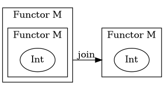
```bash
@startuml
digraph G {
  compound=true
rankdir="LR"
subgraph clusterb{
label = "Functor M";
subgraph clustera{
label = "Functor M";
 B [label="Int"]
};
}


subgraph cluster{
  label = "Functor M";
A [label="Int"]
}
B->A [label="join" ltail=clusterb lhead=cluster]


}
@enduml
```


```bash
digraph g{
    graph [
rankdir = "LR"
];
"node1" [
label = "<f0> String| <f1> List | <f2> Set| <f3> Sorted Set | <f4> Hash"
shape = "record"
];

}
```


State Diagram  only have 1 type of arrow.
Activity Diagram has less control than state diagram.


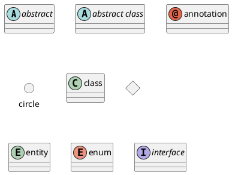
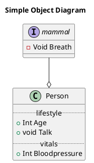

---

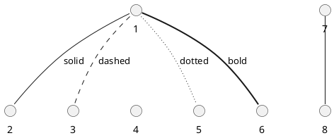


---


### Sequence diagram
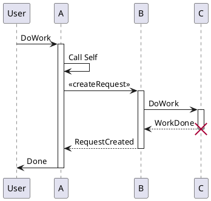

* Step into function call
  * `->`{.code}
* Step out/return from call
  * `-->`{.code}


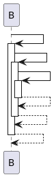

```bash
@startuml
B -> B:
activate B
B -> B:
activate B
B -> B:
activate B
B --> B:
deactivate B
B --> B:
deactivate B
B --> B:
deactivate B
@enduml
```


```bash
@startuml
autoactivate on
B -> B:
B -> B:
B -> B:
return
return
return

@enduml
```
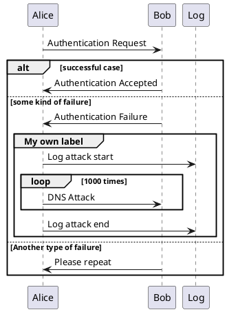

---

### graphviz
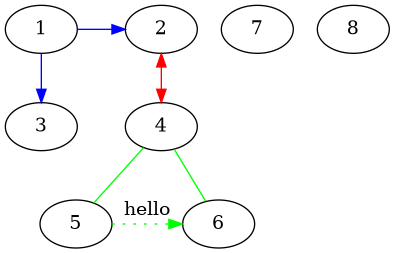
```bash
@startuml
digraph world {
size="7,7";
	{rank=same; 1 2;}
	{rank=same; 3 4;}
	{rank=same; 5 6;}
	{rank=same; 7 8;}
1 -> 2 
2 -> 3 [color=blue]
}
@enduml
```


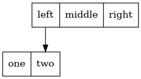

```bash
@startuml
digraph world {
node [shape=record];
struct1 [label="<f0> left|<f1> middle|<f2> right"];
struct2 [label="<f0> one| <f1> two"];

struct1:f0 -> struct2:f1;
}


@enduml
```

```plantuml
@startuml
digraph world {
rankdir=LR
node3 [shape=Mrecord, label="{ a | b | c }"]
}
@enduml
```
```bash
@startuml
digraph world {
rankdir=LR
node3 [shape=Mrecord, label="{ a | b | c }"]
}
@enduml
```
rankdir will turn the whole tree left, to right as well as "a b c"

---

### Mindmap

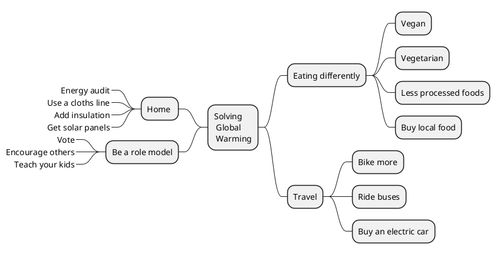


```bash
@startmindmap

* Solving \n Global \n Warming
 * Eating differently
  * Vegan
  * Vegetarian
  * Less processed foods
  * Buy local food
 * Travel
  * Bike more
  * Ride buses
  * Buy an electric car

left side
 * Home
  *_ Energy audit
  *_ Use a cloths line
  *_ Add insulation
  *_ Get solar panels
 * Be a role model
  *_ Vote
  *_ Encourage others
  *_ Teach your kids

@endmindmap
```

---

### Activity diagram

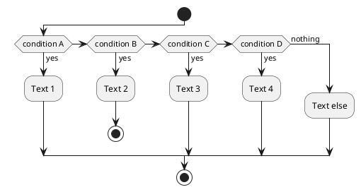


---

### Arrow list

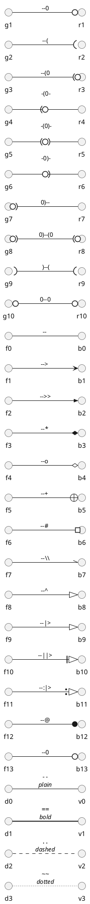