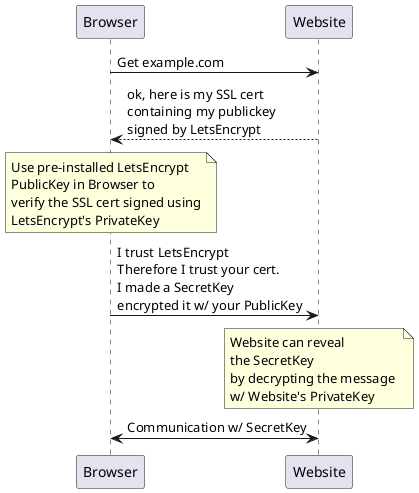

AWS Cognito uses OAuth2

OAuth2 is a protocol that typically uses JWT 

# Oauth2

4 parties: 
User(Resource Owner) on Browser,   
Leetcode(Client),  
github-auth(Authorization Server),  
github profile db(Resource Server)  

1. User(Resource Owner) goes to leetcode(Client) website
2. User has an account on github-Auth(Authorization Server) and has an github profile data there(Resource Server)
3. User(Resource Owner) wants to allow leetcode(Client) to read github profile(Resource Server)
4. User(Resource Owner) clicks linkage form on leetcode(Client) then redirects User to login form on github-Auth(Authorization Server) with a packet of data containing{Client_ID, Callback_URI, Scopes/Permissions}.
5. User(Resource Owner) logins on github-Auth(Authorization Server) 
6. User(Resource Owner) is presented with a list of permissions(Scopes presented in step 4) it will allow leetcode(Client) to have access to in the github profile(Resource Server)
7. github-Auth(Authorization Server) redirects the User(Resource Owner) back to leetcode webpage(Client) using the Callback_URI(presented in step 4) along with a temporary {Authorization_Code}
8. Leetcode(Client) contacts github-Auth(Authorization Server) directly w/o needing the User's browser. Leetcode(Client) sends {Client_ID,Client_Secret, Authorization_Code} to github-Auth.
9. github-Auth(Authorization Server) verifies the data and responds to Leetcode(Client) with an {Access Token}.
10. Leetcode(Client) can now access the User(Resource Owner) specific data on their github profile(Resource Server) using the {Access Token}

# OpenID connect

OIDC sits ontop of OAuth2  
OIDC gives a more typical behavior of a login session. 
OIDC allows a Client(Leetcode) to establish a login session and identity for the User(Resource-Owner).  
When github-auth(Authorization Server) allows OIDC, it is called an **identity provider** since it provide identity information about the User(Resource-Owner) back to the Client(Leetcode).

OIDC allows one login to github-auth(Authorization Server) to be used for multiple Client/Apps.  
Eg. Using gmail to sign into multiple apps.
This single login is called **SSO** Single-Sign-On

OIDC process is same as OAuth except at step 9, it returns {JWT ID token, Access Token}.

