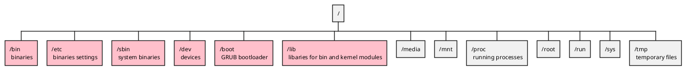

```
nano /etc/network/interfaces
```
```
/etc/resolv.
```

`whoami`{.bash}
find -name something.txt
grep "bleh" somethin.txt

echo "a" && echo "b"


`&`{.bash}
`find -name something.txt &`{.bash}
runs find in the background


Output redirection - Overwrite
>
echo "hello" > bleh.txt
echo "hey" > bleh.txt
bleh.txt will only contain "hey"

Output redirection - Append
>>
echo "hello" > bleh.txt
echo "hey" > bleh.txt
bleh.txt will contain "hello\n hey"

---

##### Checking open ports

```bash
netstat -lntu
ss -lntu
```


### Files

All your header files or ".h" files will be inside /usr/include

```bash
find /usr -name libc-header-start.h  
```

---

### Setup code-server

~/.config/code-server/config.yaml

CONVERT FROM THIS

```{.yaml filename="config.yaml"}
bind-addr: 127.0.0.1:8080
auth: password
password: idsjawij2382ruqfo
cert: false
```
TO  

```{.yaml filename="config.yaml"}
bind-addr: 0.0.0.0:8080
auth: password
password: root
cert: false
```

**In linux 127.0.0.1 means localhost but doesn't allow access from LAN**  
**0.0.0.0 allows access from LAN**  

run `code-server`{.bash} instead of `sudo code-server`{.bash} because the latter will assume root's config.yaml.

### Accessing Linux webpages from LAN

1. linux hakyll webserver to listen on 127.0.0.1:8000
2. LAN can't access server without linux first running `sysctl -w net.ipv4.conf.eth0.route_localnet=1`{.bash}