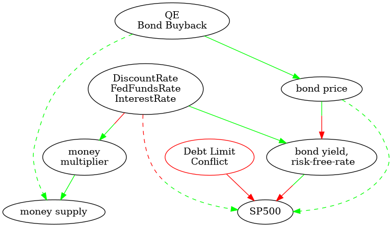

[Economic calendar](https://www.forexfactory.com/calendar)
[Econ calendar](https://www.fxstreet.com/economic-calendar)
[Important calendar](https://www.cmegroup.com/education/events/economic-releases-calendar.html#)

use world bank api
https://datahelpdesk.worldbank.org/knowledgebase/articles/889386

https://www.oecd.org/coronavirus/policy-responses/a-debt-standstill-for-the-poorest-countries-how-much-is-at-stake-462eabd8/  

* PMI (Monthly) for current month is published on the first business day of the next month
  * example PMI for Jan will be published on Feb 03 monday.
* Non-farm payroll (Monthly) for current month is published on the first friday of the next month
  * example non-farm payroll for Jan will be published on Feb 07 friday
* Housing-start (Monthly) for current month is published in the middle of the next month
  * example Housing-start for Jan will be published on Feb 19
* CPI (monthly) measuring inflation for current month is published in the middle of next month
  * example CPI for Jan will be published on Feb 20
Stock price represents Net Present Value of Future Cash Flows. This is measured using DCF.

GDP is old redundent news because PMI already tells us the health of the economy in a more frequent manner.
* GDP (Quarterly) is slower than PMI (Monthly)

<!--  -->
* PMI : Business Confidence
* CPI : Consumer basket of goods inflation
* Non-Farm payroll : Unemployment

# Currencies

* Fixed Exchange rate = Pegged Exchange Rate
* After WW2, USA pegged dollar to gold stored in fort knox
  * After vietnam war, Nixon unpegged dollar to gold and started the fiat currency regime
* Just 15 days of global fx transactions amounts to the world's annual GDP.

<!--  -->
* Govt uses fx-reserves AKA currency reserves to control currency value
  * USD is most common currency to build fx-reserves since it is the most liquid
  * If a currency is too strong, fx-reserves(USD)

<!--  -->
* Govt that restrict withdrawals is a bad signal for currency value
* Govt freezing bank accs is bad sign
* Govt defaulting on bonds is bad sign
* Govt owing debt to the IMF and World Bank is bad sign
* Govt losing it's Fixed Exchange Rate status is bad sign

<!--  -->
* Goal for most Govt is to maintain/defend their Peg aka Fixed Exchange Rate
* Govt can increase interest rates to maintain their Peg and increase value of Currency
  * Eg. German bonds can only be Bought with German Currency. 
  * German Govt Increase Interest rate to Increase demand for German bonds. 
    * SideNote Raising interest rate, increases new bond yield, decreases price of old bonds
  * People around the world buy German Currency to buy German bonds.
  * Opposing Govt may need to compete by increasing their own Interest Rates.
    * Note that raising Interest Rates hurt consumers because mortgages cost more so it's a balancing act between being Globally Competitive vs Domestic Livelihood.
<!--  -->
* Example crisis: Peso to dollar decrease 10%, Interest rates jumped
* Govt increases interest rates to combat inflation or increase value of currency
<!--  -->
* 60 Yen/USD means 60 Yen to buy 1 USD
* **Increase in Exchange Rate of numerator(Yen) = Weakening of Currency wrt denominator (USD)**
* Increase in Yen/USD means Yen weakened or devalued against USD
* Decrease in Yen/USD is good for Exports and Stockmarket for Japan
<!--  -->
* Increasing graph of Yen per USD means:
  * Yen Weakening to USD
  * USD flows to Japan Yen-using companies
    * Yen-using companies in Japan gaining more revenue
<!--  -->
* 3 Factors affect Currency: Interest rates, inflation, Big company trades
  * Interest rates move with Currency 
  * Inflation(CPI) weakens Currency
  * GDP = ... + (Export - Import)
    * US Export goods to India: India has to sell Rupee for USD, Makes USD Stronger
    * US Import Indian Goods: US has to sell USD for Rupee, Makes USD Weaker
    * Example: Russia is main exporter of Urals Crude Oil, Drop in Oil price predicts drop in Ruble wrt USD
      * Russia sells its Foreign Currency Reserves(USD) to stabilize it's Ruble

## Trade weighted Basket

* Trade weighted Basket determines hwo strong a currency is
* `DXY`, dollar index is used to show relative strength of dollar
* Big Mac index aka PPP shows us whether a currency is overvalued

[Fed funds target rate](https://fred.stlouisfed.org/series/DFEDTARU)

## Investing in Foreign markets, Currency risk

* Imagine you invest TOPIX(Tokyo exchange), you must convert USD to yen
  * if TOPIX goes up 30%  
  * Yen wrt. USD goes up 20% meaning the Yen weakened wrt USD
  * you really only made 1-(1.3/1.2)= 8.3% USD since you have to convert the Yen back to USD.

## Currency affecting Export thus Stockmarket

* If country does alot of exports then lower currency value
  * Increases exports for big companies due to attractive prices
  * Increases GDP and stock market 

## FX forecast model

* Attempts to predict currency movement in the future for some chosen time period as a normal dist based on past history

## Currency Forward, hedging foreign purchase

* You want to buy french company in 10 years
* Predict USD will weaken wrt to Franc
* Buy 10-yr forward contract on USD/Franc

# GDP

real GDP = inflation_normalized(nominal_GDP)

Recession = 2 consecutive quarters of negative real GDP

# Rates

* Fed raises interest rates to decrease Inflation(CPI)
<!--  -->
* Why is deflation also bad?
  * People save, Less exports and More imports
  * Japan intentionally tries to cause inflation (weakening it's currency)
  * Bad for stocks because it's harder for business to get loans and export goods

EU interest rate is called the refinancing rate

Oct. 1 to Sept. 30

Fed saying they will lower bank's (interest rate/federal funds rates/ nominal rate)-> increase money supply -> inflation
Fed's interest rate is inversely proportional to money multiplier.

Raising debt limit

Rising bond yield hurts the SP500
Bond yield = Risk free interest rate

Higher risk free interest rate lowers relative values of equity future earnings

Federal reserve chair saying "Inflation" will hurt equities

* Lower interest rate increase demand for bond thus increase price of bonds
* Low interest rates mean companies can borrow on low interest meaning => pay less for production => Lower cost of goods produced

# Bond

* Inverted Yield Curve : 10-yr bond have lower yield than 3-yr bonds
* **Bonds like stocks are traded on the market meaning bond price fluctuates like stocks**
* Like credit card APR, Yield = Bond APR
  * Bond APR depend on bond price but since price fluctuates, so does Bond APR
    * Bond APR fluctuates but the flat interest payment are a fixed amount
* Bond principal just means the raw initial borrowed money is paid back at the end of the bond
  * When person buys a bond, they are loaning the principal 
    * at the end of bond life they get back the initial principal + interest payments
* When fed makes interest rate go up, new bonds to be issued will have higher yields but old bonds in circulation have the same yields meaning they are worth less so the old bonds in circulation will decrease in price.
<!--  -->
* "President will stop paying government debt and force creditors to take 30 percent loss on their capital"
  * means bonds defaulted early
<!--  -->
Factors that affect bondprice and yield

* Debt to GDP ratio (What matters most is if the change in ratio is spiked(Bad,Grrece) or smooth(Ok,Japan)). Japan has highest debt ratio but consistent since Japan was artifically inflating it's economy by printing yen and buying bonds. Greece debt ratio spiked.
* Budget_Deficit to GDP ratio (EU 3% is normal, 9% is greece level bad)
* Repayment schedule

* Govt GDP steroid boost through borrowing for large domestic projects => short term GDP boost, long term GDP inhibition
  * The moment Govt borrows money to pay for big projects, GDP gets bumped up immediately according to value of the project 
  * BUT when Govt how to pay that debt, the GDP will slow over time.
Treasury bond price inverse to Yield
<!--  -->
* Inflation corrodes bond profits meaning people are going to pay less for the bond resulting in high yield
* High interest rates mean new bonds are better value so current bonds need to price themselves lower in the market which will bump up bond yield

Treasury bond Interest Rate is not same as Federal funds interest rate.
When news say Fed is lowering interest rates, them mean fed funds rate.

[Bond yield](https://tradingeconomics.com/united-states/government-bond-yield)

Rising bond yield Hurts stocks because Up Bond yield = Up Discount Rate implying Lowered Discount Cash Flow.

Fed raises interest rates to lower inflation. High CPI signals the Fed is likely to increase rates means stocks may drop.

* high coupon low yield have a high bond price

## Corporate Bonds vs T-bill yield

* Corporate Bond yield are influenced by T-bill yield
  * Lower T-bill yield => Lower Corpo Bond yield => Lower Corpo borrowing cost
  * Higher T-bill yield => Higher Corpo Bond Yield => Higher Corpo borrowing cost 
* Spread = Corpo Bond Yield - T-bill Yield
  * Assuming T-bill is stable:
    * Tightening: Spread decreases = Lower Corpo Bond yield
    * Widening: Spread increases = Higher Corpo Bond yield
* In 2008 the spread increases because big banks go bankrupt so people lose faith in companies.

## Mortgage rate vs T-bill yield

* Mortgage rate are influenced by T-bill yield
 * Lower T-bill yield => Lower Mortgage rate => More home buyers
* Mortgage rate and T-bill yield have a stable spread aka difference
  
## Yield of different nations

* Yield of the biggest nations are mean-reverting wrt the US yield

## Brexit

* Brexit caused Euro and Pound to go down
* Ppl started buying Gold, US Bonds, and Yen to protect themselves
  * Bond price goes up from demand causing yield to go down.

<!--  -->
* Economist initially predicted recession after hearing Brexit but they were wrong

# Credit Default Swap, Credit Ratings and Bond price/yield
* Credit agency are hindsight, not trustworthy. example Lehman brother keep "strong buy" on enron even though it was about to be bankrupt because Lehman brother was working on a merger deal between Dyson Energy and enron.
  * Lesson be suspect of "Strong buys" when speculative mergers are in the air
* CDS are more reliable than credit agencies (up 30 basis point is a lot)
* High CDS, High Bond yield, Low bond price signal bad unstable govt

# Investigating Companies

* Look at it's `Capital Structure` which reveals it's subsidiaries.
  * It also shows Shareholders(stock owners) and Lenders(bond owners)
* Why do companies sell bonds aka Borrow?
  * Companies financed through debt have lower taxes
* Corporate bonds are also affected by govt bonds
  * unstable govt means high yield govt bond, and companies will have high yield bonds as well

# War and inflation

* Govt prints money for war, economy gets inflated at least 10%
  * Inflation is good for stock market, bad for consumers

# Inflation gauges

* GDP deflator(quarterly)
* CPI (Monthly)
* Core personal consumer exp (strips out cost of food and energy)
* **Treasury Inflation Protected Securities**(TIPS) are instruments that resist inflation and deflation. TIPS can be used as a measuring stick against bond yield to see whether market is inflated or deflated.
  * TIPS payout increases with inflation countering artifical loss in value
  * TIPS payout decreases with deflation countering artifical bump in value
* OUTPUT GAP shows ideal output vs real output 
  * if real < ideal, means positive percent output gap meaning  signal deflation
  * if real > ideal, means negative percent output gap meaning signal inflation

# FOMC statement

* FOMC can carefully craft it's statement to intentionally affect inflation 
* hinting "QE might taper down" statement is a tactic that drives bond price bond and increase yield
  * "If we see continued improvement and we have confidence that is going to be sustained, we could in the next few meetings take a step down in our pace of purchases"

* FOMC interest rate announcements on 2:00 PM on 
 * Jan, March, May, June, July, September, October, December

 https://data.oecd.org/interest/long-term-interest-rates-forecast.htm

 https://www.cmegroup.com/trading/interest-rates/countdown-to-fomc.html

## 1-mo 3-mo T-bill = Fed Funds interest rate

* The short term T-bills(1-mo, 3-mo) are approx same as Fed Funds interest rate or target rate
  * One can use Fed-funds interset rate prediction graphs to predict future value of short term T-bills
<!--  -->
* Inflation is the main driver of long-term T-bills(10-Yr) meaning we can use inflation prediction graph to predict long term T-bills
* High expectation of inflation = High Long term Yield

# Inverted Yield Curve

* Normal yield curve look logarithmic
* Inverted yield curve looks flipped making a small concave shape 
* Assuming past low Fed rates => Fed hikes rates => Yield curve will steepen with 10 yr bond yield increasing the most
* Yield curve is firmly anchored onto Fed official interest rate on one end but the other end floats depending on mood

# Yield Curve Scenarios

* Example 1
  * Initial condition: Fed Interest rate is low therefore short-term yield is low
  * Input: Investors predict Fed will bump interest rates but Fed did not bump rates yet
  * Output: Yield curve Gets hard and the 10-yr end rises
  * Input: Feds actually bump rates
  * Ouput: Yield curve 1-mo end rises making the yield curve flatter
  * Input: Investors predict Fed will cut interest rates once the Economy starts to slow
  * Output: Investors buy 2,5,10yr bond because cut rates mean the long term bond price goes up. With investors buying so many bonds, the price of long term bond increases and yield decreases. Yield curve inverts.

<!--  -->
* How does Inverted Yield curve happen?
  * When fed rates are high and ppl predict rate cuts so they buy long-term bonds in hopes of profiting.
    * high fed rates = high short term yield
    * high demand buying long-term bonds = low long term yield
<!--  -->
* Inverted yield curve tells us ppl believe economy is in bad shape and this causes stock market correction AKA dips

GC3D function for yield curve

# Bond traders and Fed rate hikes

* Bond traders sell when they believe Fed will hike rates
* Bond traders buy when they believe Fed will cut rates

# Quotes

* "Monetary Stimulus program" = QE = Fed lower rates
* "Fed considers Tapering" = Fed raising rates

# Stocks

* Dow Jones is calculated by adding share price 
* Look at point moves to see how much a certain stock contributed to SP500 move
* Dividend yield means how much percent of 1 stock is paid as a dividend in one year. A 50% dividend yield means half the price of the stock is paid as dividend.

## Earnings

* Earnings come out 3-5 weeks after each quarter ends
  * Q1: April
  * Q2: July
  * Q3: October
  * Q4: Jan + Feb

# Valuation

* Absolute valuation vs Relative valuation

## Absolute Valuation

1. Extrapolate historic cash flow to estimate future cash-flows
  * cash flow is found at Net Income, GAAP
2. Estimate Discount rate **WACC**
  * WACC reduces the future value of cashflow
3. Discounted Cash flows = Apply(WACC,estimated_future_cashflow) 
4. Get Net Present Value of Discounted Cash flows
  * Enterprise value is analogous to what we calculated except EV is just the current book value, not taking into account predicted value
5. Subtract firm debts and Add firm's cash to get estimated market Cap
  * Debt is bondholder ownership so we subtract
  * Cash is shareholder ownership so we add
  * Similarly we can get actual Market Cap by adding cash and subtracting debt with Enterprise Value
6. Divide estimated market cap with # shares to get estimated share price

<!--  -->
* Lower Fed interest rate => Lower 10-yr bond yield => Lower WACC => Higher Estimated Shareprice
* Higher Fed interest rate => Higher 10-yr bond yield => Higher WACC => Lower Estimated Shareprice
<!--  -->
* No company can outgrow the nominal GDP(5%) in the infinite long term because otherwise the company would overtake the nation.
  * Discounted Cashflow doesnt care for the super long term because at best it will be growing at nominal GDP(5%)
  * WACC typically greater than nominal GDP growth, meaning WACC will grind down future value so that super long term is worthless
<!--  -->
### Debt funding 

* Debt-funded companies are basically leveraged stocks
  * analogy buying a house on mortgage, bank holding mortgage is bond-owner, you are the share holder
  * House is worth 100k(Enterprise Value)
  * You pay 90k is debt(bond-holder ownership) on mortgage, 10k is your deposit(Market Cap AKA stock value AKA shareholder ownership)
  * House value bumps 200% to 200k
  * Your 10k is now 110k (200k-90k = 110k) which is 110% increase
    * New market cap is 110k
    * **Akin to paying 10k to buy stocks in a debt-funded company and seeing a 110% increase in stock price.**

### Enterprise value vs Market Cap vs Debt

* EV = StockHolderOwnership + BondHolderOwnership
* MarketCap = StockHolderOwnership
* Debt = BondHolderOwnerShip

### WACC 

* Company structure funded by 88.8% equity, 11.2% debt
  * 88.8% equity mix * 8.9% cost of equity = 7.9% contribution from equity
  * 11.2% debt mix * 1.9% cost of debt = 0.2% contribution from debt
* WACC = 7.9% contribution from equity + 0.2% contribution from debt = 8.1%

#### Beta

* Higher Beta => Higher WACC => Lower Valuation

## Relative Valuation

* Dividend Yield = Percent of 1 share that is paid annually
  * 50% dividend yield of a $150 share means every year we get $75
* PE ratio = EPS/SharePrice
* Earnings yield = Inverse(PE ratio)
* Estimated PE ratio uses Estimated EPS

### Earnings, PEratio, MarketCap
* Problem
 * Earnings vary each Year
 * Price vary every minute

* Low PE ratio follow low sales growth

* It's all about the differential
* Think of Price in PEratio as MarketCap
* When Price grows as Earning grows, PEratio will start to fall
  * Growth company growing
* When Price stays constant and Earning grows, PEratio fall
  * Turning into a stable blue chip

#### PE ratio signal

* Earning trend down, Price exponential up, PE Ratio exponential up => BAD SIGN
* Look at high sales growth with low PE ratio for attractive stocks
  

Summary

LINEAR PROG
ASSUMPTIONS
INPUT Cost-function, decision-variable
OUTPUT optimal-decision-variables

OPTIMAL TRANSPORT is example of LINEAR PROG
Two types of nodes, supply nodes(initial object) and demand nodes(terminal object)
Each initial object has required min capacity
Each terminal object has required min capacity

The decision variable are basically the intensity of edge between these nodes.  
More intense edges mean more items delivered between nodes.  

