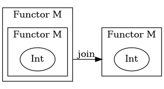
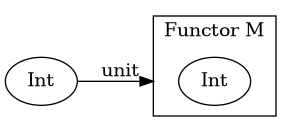
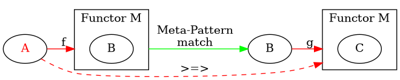

 > Remember js promises. Once you start dealing with promises, you have to keep chaining them and you cant escape. The same pattern is shown in monadic operations.


$$ \mu :: M \circ M \rightarrow  M $$
$$\begin{align}
X \overset{f}{\longrightarrow} MY \qquad \qquad & \\
\underline{\qquad \qquad \qquad \qquad Y \overset{g}{\longrightarrow} MZ}& \\
X \overset{f}{\longrightarrow} MY \overset{Mg}{\longrightarrow} MMZ \overset{\mu_Z}{\longrightarrow} MZ &
\end{align}$$
$\mu$ is join in haskell
I is the identity functor.  
M is the monad functor.  
$$ \eta :: I -> M $$
Since $\eta$ is a natural transformation we can expand this to.  
$$ \eta :: \forall a. Ia -> Ma $$
Eta is `return :: a -> m a`
```haskell
class Monad m where
  (>>=) :: m a -> (a -> m b) -> m b
  
   
  return :: a -> m a
 
  (>>) :: m a -> m b -> m b
  a >> b  =  a >>= \_ -> b    
```






## Join

* aka flatmap, turns 

```hs
flatmap :: list list a -> list a
join :: m m a -> m a
```


## Bind

```haskell
(>>=) :: Monad m => m a -> (a -> m b) -> m b
```

### Kleisli Category

* f,g are morphisms
* (>=>) is composition

$$ f :: a \rightarrow m\ b$$
$$ g :: b \rightarrow m\ c$$
$$ >=> :: $$

$$\text{Meta-Pattern Match} :: m\ b \rightarrow b$$

```{.haskell .numberLines}
(>=>) ::  (a -> m b) -> (b -> m c) -> (a -> m c)

f :: a -> m b
g :: b -> m c

f >=> g :: \x ->
  let (p, sideEffect1) = f x
      (q, sideEffect2) = g p
   in (q, sideEffect1 ++ sideEffect2) 

```



The red are the arguments of (>=>)

* x :: A  (line 6)
* extract p :: B from f x :: M B
  * green pattern match is extraction (line 7)
* extract q :: C then repackage into (q,..) :: M C
  * line 9 not shown in diagram
  
### Proving a Type of Function cannot exist

```haskell

 transform :: forall m a b. Monad m => (a -> m b) -> m (a -> b)

--assume by contradiction
--Specialize m to the continuation monad ((_ -> r) -> r)
 transform :: forall a b r. (a -> (b -> r) -> r) -> ((a -> b) -> r) -> r

 --Specialize r=a
 transform :: forall a b. (a -> (b -> a) -> a) -> ((a -> b) -> a) -> a

 --currying 
 transform const :: forall a b. ((a -> b) -> a) -> a

 --this is Peirce's Law, which is not provable in intuitionistic logic. Contradiction.
 ```


# String diagram + Wiring diagram

 ```bash
+----------+----------+        +----------+----------+
|          |          |        |          |          |
|        functor      |        |      <---+-----+    |
|          |List      |        |                |    |
|        +-+--+ Object|        |List int+----+  |    |
| Object |nat |  Type |        | -->    |nat |  C    |
|   Type +-+--+       |        |Maybe   +-+--+  |    |
|          |functor   |        | Int      |     |    |
|          |Maybe     |        |    <-----+-----+    |
+----------+----------+        +----------|-----+----+
```


# Simply function application

* piping is just the reverse of typical function application
* piping is the theory behind monads

```py

f = (lambda x: (lambda y: ( lambda z: x + y + z )(7))(5))(4)

#pipe is just a function application but w/ reversed parameter order
pipe = lambda x: (lambda f: f(x))
f2 = pipe(4)(lambda x: pipe(5)(lambda y: pipe(7)(lambda z: x+ y+ z)))
#f2 is a nested pipe

print(f)
print(f2)
```
* 4 is piped into x which outputs a nested lambda that pipes 5 into y
* 5 is piped into y  which outputs a lambda that pipes 7 into z
* 7 is piped into z


# CPS 

```hs
def add(x,y,c):
    c(x+y)
def mul(x,y,c):
    c(x*y)
    
def baz(x,y,c):
        mul(2,x,lambda v,y=y,c=c: add(v,y,c))
  -- expands to (lambda v,y=y,c=c: add(v,y,c)) Applied to (2*x)
  -- reduces to lambda y=y,c=c: add(2*x,y,c)

baz(2,5,print)
```