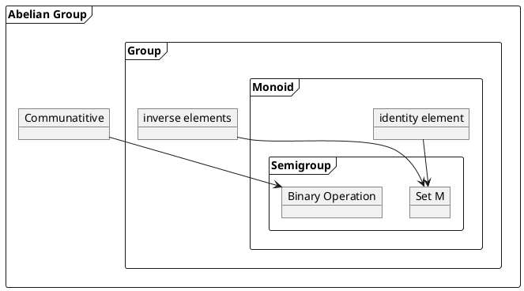

```bash
#print vector_space
vector_space (R: Type u) (M: Type v) [field R] [add_comm_group M] := semimodule R M
```

vector space is a 

* semi-module over a
  * field R 
  * additive communitative group M
```plantuml

```

## Direct Sum

> Find two unrelated spaces in your universe and slam them together 

Given some vector space $S$, we choose some subspaces $\{X,Y,Z...\}$

1. None of these subspaces share any element but the null vector
2. there is no combination of $\{Y,Z...\}$ that can form an element of $X$.

take an element from each subspace in $\{X,Y,Z...\}$ then add them.  
$$\oplus \{X,Y,Z...\} = \{x + y + ... | x \in X, y \in Y ...\}$$ 

## Direct Sum of matrices

Given that $A$ and $B$ are matrices themselves.  
Note that $0$ stands for zero matrices of varying sizes.  
Block matrix notation of direct sum:  

$$A \oplus B = \begin{bmatrix}
A & 0 \\
0 & B 
\end{bmatrix}$$

$$B \oplus A = \begin{bmatrix}
B & 0 \\
0 & A 
\end{bmatrix}$$

$$ A \oplus B \cong B \oplus A $$

* Direct sum is commutative up to isomorphism

### Example

$\{(x,0) | x\in \mathbb{R}\} \oplus \{(0,y) | x\in \mathbb{R}\}=\mathbb{R}^2$ or written as   
$(\mathbb{R},0) \oplus (0,\mathbb{R})$   
but some might even do notational abuse and just write   
$\mathbb{R} \oplus \mathbb{R}$


# Linear Map

$$ T \in \mathcal{L}(V,W) $$

`T :: V -> W`{.hs}

# StoryTime

Vector space of cars
Field of colors
Add means "mix"
  
Red car mix Blue car can be exchanged for a purple Car and vice-versa.   

Vector space of cars equivalent to saying a magic rainbow brush that can paint any car.  

* Basis vectorspace: cars of fundamental colors.  
* Zero-Vector: The no-car when painted with any color still results in the no-car. 
* Inverse: Green car mix Red car makes the no-car. Green is known as anti-red.

Linear Map `T :: Cars -> Trucks`{.hs}  
We can exchange our painted cars for painted trucks.  

T is linear map if 

* we can trade a red car for a red truck, blue car blue truck, etc.  
* we can trade "red car mix blue car" for a "purple truck"


Proof: Dim Range + Dim Null

* red car trades for purple truck
* yellow car trade for purple truck
* red car mix anti-yellow car trades for no-truck.
* Null space = red mix anti-yellow car
* Range = purple truck

Notice how the 2 cars collapse into the 1 purple truck in the range  
is given back through the 1 "red mix anti-yellow car" in the null space


# Spectral Theorem

* Hermitian operator 
  * For Real vector space its symmetric matrix
  * For Complex vector space its symmetric complex conjugate matrix
  * For Infinite dim vector space its Complex self adjoint 
* Symmetric matrix means it looks the same when transposed
* Typically a random matrix has complex and real eigenvalues regardless of elements are only real
* **Spectral Thm: A Hermitian(symmetric) matrix that can have complex or real elements will always have real eigenvalues**
  * Eigenvectors are orthogonal


# 2 by 2 matrix  

## Positive definite matrices

Given a symmetric 2 by 2 matrix, four ways to tell if positive definite:  

1. Eigenvalue test: $\lambda_1 \gt 0, \lambda_2 \gt 0$
2. Determinants test: $a \gt 0, ac - b^2 \gt 0$
3. Pivot test: $a \gt 0, \frac{ac-b^2}{a} \gt 0$
4. $x^TAx$ is positive definite except when $x=0$  (the actual definition of positive definite)

Note that $x^TAx$ results in an eqn like $2x_1^2+12x_1x_2+18x_2^2$ and if this eqn is postive for all real $x_1, x_2$ then the matrix $A$ is postive definite.