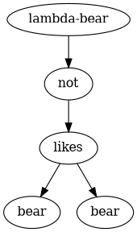
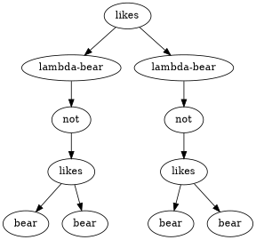
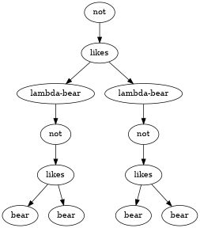
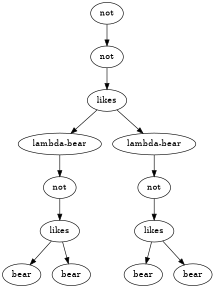
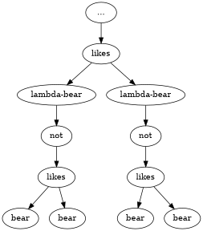

# Russell's paradox with Sets 

Russell's paradox starts by designing a Set S that contains/specifies all Sets that are not elements of itself. (Note everything in our current model is a set; even the elements of sets are sets)
$$ S = \{ x | x \notin x \} \tag{1}$$
Next we ask can S be an element of S?  
[Assume S is element of itself] 
$$S \in S \tag{2}$$   
[This would imply by definition (1)]
$$S \notin S \tag{3}$$
[By contradiction (2) and (3)]  
$$S \notin S \tag{4}$$

[but by the definition of (1) ]  
$$S \in S \tag{5}$$  
...thus the whole process repeats infinitely  
It is a paradox because there is no end to this proof ( we cannot conclude whether it is true or false )

The resolution is to bound the universe so that S must be within a universe.  

# Russell's paradoxal set S as an AST

  

# Analogy and Abstracting Russell's paradox with bears
In set theory, the propositional function is elementhood.
Elementhood takes two sets (lets call the universe that contain our sets of interest, $SET$) and return a truth value. Also remember everything is a set.  
We can think of our standard set theory as a pair that contains the universe and it's associated function.
$$(SET,\in)$$

$$ \in :: (SET,SET) \rightarrow bool $$ 

Let's design another theory $$(BEAR, like)$$ with $BEAR$ being defined as the universe of bears.  
$$ like :: (BEAR,BEAR) \rightarrow bool $$

Just like our initial set model, lets pretend everything in our universe is a bear and instead of set containing sets, we have bears liking bears.  

And with theory let's design a paradox using groups of bears and "like".

* Arbitrary bear y that likes bear B iff P(y,likes) is true 
* Arbitrary set x are elements of set S iff P(x,$\in$) is true 
    * where P(x,action) stands for negation of action(x,x) 

Note the similarities between our Set theory and Bear theory.

In other words,  
any bear y must like bear B if and only if bear y does not like itself

# AST with Bears

[Let us define bear B as this AST]  

[bear B likes itself]  

[therefore bear B does not like itself]  

[But this means bear B does not not like itself, which is a double negative, meaning bear B likes itself]

[and so on and so forth...]  

## End

Next post will be a short one showcasing the powerful Y-combinator which is closely related to this paradox.  
[Part2 - YCombinator and Recursive  functions](/posts/2018-05-23-YParadox2.html)