```plantuml
@startsalt

{
    {T
     + file           | detail
     + playGO  | dir
     ++ go.mod
     ++ go.sum
     ++ main.go       | package "main"
     ++ component     | dir
     +++ bleh.go      | package "duhr"

    }
}

@endsalt
```

| Concept | Go | JS | Java |
| --- |---| --- | --- |
| Dependencies | go.mod | package.json | pom.xml |
| Autogen dependency| go.sum | package-lock.json | |

# Quick Summary

{go package 1, go package 2} $\in$ Go module   
**go packages** are *.go files  
**go module** is the directory holding the *.go files  

* The reference name of go packages are declared inside the go file but typically we use the same reference name as the file name.
* Go packages do not import other Go packages, **Go packages CAN ONLY IMPORT DIRECTORIES containing Go packages**
  * `import( "~/playGO/component" )`{.go} will import the Directory component and All the *.go packages inside the component directory 

When calling functions from imported go packages remember:
**Lowercase function name is package-public**  
**Uppercase function name is package-private**   


# Go module

## go.mod: Init root dir 

```bash
mkdir projectFolder
cd projectFolder
go mod init github.com/UserJY/playGO
```
This will autogenerate `go.mod`{.md} file

* `github.com/UserJY/playGO`{.md} is the name and the **root directory** of our module  


## go.sum: Download dependencies 

```bash
go get -u github.com/gin-gonic/gin
```
This will autogenerate `go.sum`{.md} file

## Explore go.mod go.sum

```{.go filename="go.mod"}
module github.com/UserJY/playGO

go 1.16

require (
	github.com/gin-gonic/gin v1.7.7 // indirect
  ...
	gopkg.in/yaml.v2 v2.4.0 // indirect
)
```
`// indirect`{.go} means your go project is not using the dependency.  
`go mod tidy`{.go} after using the dependency to tidy it up.

```{.go filename="go.sum"}
github.com/creack/pty v1.1.9/go.mod h1:oKZEueFk5CKHvIhNR5MUki03XCEU+Q6VDXinZuGJ33E=
golang.org/x/tools v0.0.0-20180917221912-90fa682c2a6e/go.mod h1:n7NCudcB/nEzxVGmLbDWY5pfWTLqBcC2KZ6jyYvM4mQ=
google.golang.org/protobuf v1.26.0/go.mod h1:9q0QmTI4eRPtz6boOQmLYwt+qCgq0jsYwAQnmE0givc=
g
gopkg.in/yaml.v2 v2.2.2/go.mod h1:hI93XBmqTisBFMUTm0b8Fm+jr3Dg1NNxqwp+5A1VGuI=
...
```

`go.sum`{.md} is just the transitive closure of dependencies.  
Analogous to `package.lock.json`{.md}


# Packages

## main.go component/bleh.go

```{.go filename="~/playGO/main.go"}
package main

import (
	"fmt"
	"github.com/UserJY/playGO/component" 
  //we import the DIRECTORY "component"
  //we do not import bleh.go or duhr
)

func main(){
	fmt.Println(duhr.Somefunc())

}
```

`mkdir component`{.bash} Create component directory

```{.go filename="~/playGO/component/bleh.go"}
package duhr

func Somefunc() int { // "S" in Somefunc() MUST BE CAPITALIZED
	return 2
}
```

**"S" in Somefunc() MUST BE CAPITALIZED since it is package-public**  
This allows main.go to use Somefunc()   
`duhr.somefunc()`{.go} WILL FAIL since it is lowercase package-private  

# Running

try below (will fail because we are running locally)

```bash
go run .

# main.go:5:2: no required module provides package github.com/UserJY/playGO/bleh; to add it:
#         go get github.com/UserJY/playGO/bleh
```

To run locally:

```bash
go mod edit -replace github.com/UserJY/playGO/component=~/playGO/component
```

this will add `replace github.com/UserJY/playGO/component => ~/playGO/component`{.go} to your `go.mod`{.md} file