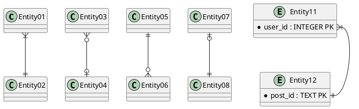

[on CAP](https://jepsen.io/consistency)
[on CAP 2](https://www.the-paper-trail.org/page/cap-faq/)


```{.sql filename="buildtable.sql"}
CREATE TABLE bleh (id INTEGER PRIMARY KEY, name TEXT, age INTEGER);
INSERT INTO bleh (name,age) VALUES ('bob',30);
INSERT INTO bleh (name,age) VALUES ('rex',2);
.mode column
.headers on

```

# Quick Theory

Tables are represented as relations $(A\times B\times C)$  
$A$, $B$, $C$ are the columns of the table

| Symbol | Name | Operation | Related SQL | 
| --- | --- |  --- | --- | 
| $\pi$ | Projection | $(A\times B\times C)\rightarrow (A\times C)$ | Select a,b FROM .. |
| $\sigma$ | Selection | $\{x\in (A\times B\times C)\ |\ Pred(x)\}$ | ... WHERE a*b==3 |


# Syntax

```rroad
Diagram(Stack(Optional(Sequence(Terminal('WITH','#sql-with'),OneOrMore(Sequence(NonTerminal('name'),'AS','(',NonTerminal('select','#sql-select'),')'),',')),'skip'),Sequence(Terminal('SELECT','#sql-select'),Optional('DISTINCT','skip'),Choice(0,'*',OneOrMore(Choice(0,Sequence(NonTerminal('column'),Optional(Sequence('AS',NonTerminal('output_name')))),Sequence(NonTerminal('expression','#sql-valueexpr'),Sequence('AS',NonTerminal('output_name')))),',')),Terminal('FROM','#sql-from'),OneOrMore(Choice(0,Sequence(NonTerminal('table_name'),Optional(Sequence('AS',NonTerminal('alias')))),Sequence('(',NonTerminal('select'),')',Sequence('AS',NonTerminal('alias')))),',')),OneOrMore(Choice(0,Skip(),Sequence(Choice(0,Sequence(',',Comment('oldsyntaxforcrossjoin')),Sequence(Choice(0,'CROSS','NATURAL'),'JOIN'),Sequence(Choice(0,Sequence(Optional('INNER'),'JOIN'),Sequence(Choice(0,'LEFT','RIGHT','FULL'),Optional('OUTER'),'JOIN')),Choice(0,Sequence('ON',NonTerminal('condition')),Sequence('USING','(',OneOrMore(NonTerminal('join_column'),','),')'),Sequence('NATURAL')))),Choice(0,Sequence(NonTerminal('table_name'),Optional(Sequence('AS',NonTerminal('alias')))),Sequence('(',NonTerminal('select'),')',Sequence('AS',NonTerminal('alias'))))))),Sequence(Optional(Sequence(Terminal('WHERE','#sql-where'),NonTerminal('condition')),'skip'),Optional(Sequence(Terminal('GROUPBY','#sql-groupby'),NonTerminal('expression','#sql-valueexpr')),'skip'),Optional(Sequence(Terminal('HAVING','#sql-having'),NonTerminal('condition')),'skip')),Sequence(Optional(Sequence(Choice(0,'UNION','INTERSECT','EXCEPT'),Choice(0,Skip(),'DISTINCT','ALL'),NonTerminal('select')),'skip'),Optional(Sequence(Terminal('ORDERBY','#sql-orderby'),OneOrMore(Sequence(NonTerminal('expression','#sql-valueexpr'),Choice(0,'ASC','DESC')),',')),'skip')),Sequence(Optional(Sequence(Terminal('LIMIT','#sql-limit'),Choice(0,NonTerminal('count'),'ALL')),'skip'),Optional(Sequence(Terminal('OFFSET','#sql-limit'),NonTerminal('start'),Optional('ROWS')),'skip')),Sequence(Optional(Sequence(Terminal('FETCH FIRST','#sql-limit'),NonTerminal('count'),Optional('ROWS'),'ONLY'),'skip'))))
```


[ReLaX](http://dbis-uibk.github.io/relax/help)


# JOINS


TableA has 3 cols  
TableB has 7 cols  

TableA Join TableB, we end up with 3+7 cols

Left Join , 3 cols


# Normalization

## 1NF - Remove redundent Groups

make separate table for each set of related attr

## 2NF - Eliminate Repeats

Some value repeats multiple times.  
Collapse the dependency into a new table.  

## 3NF - Move out Cols not dependent on Key

## 4NF 

# Entity Relation




```bash
@startuml
Entity01 }|--|| Entity02
Entity03 }o--o| Entity04
Entity05 ||--o{ Entity06
Entity07 |o--|| Entity08

entity Entity11{
 * user_id : INTEGER PK
}
entity Entity12{
 * post_id : TEXT PK
}

Entity11::user_id }|--|| Entity12::post_id
@enduml
```

# Timescale


```bash
docker run -d --name timescaledb -p 5432:5432 -e POSTGRES_PASSWORD=password timescale/timescaledb:latest-pg14
```

login with username "postgres"
```bash
psql -U postgres -h localhost

tsdb=> CREATE database example;
```
```bash
# connect to db named "example"
tsdb=> \c example

# list tables
tsdb=> \dt
```

# Db Driver

```py
import psycopg2
```
```py
username = "postgres"
password = "password"
host = "localhost"
port = 5432
dbname = "example"
CONNECTION = f"postgresql://{username}:{password}@{host}:{port}/{dbname}"
```
```py
with psycopg2.connect(CONNECTION) as conn:
    cursor = conn.cursor()
    SQLquery = """
    DROP TABLE IF EXISTS "btc_prices";
    CREATE TABLE "btc_prices"(
   time            TIMESTAMP WITH TIME ZONE NOT NULL,
   open   DOUBLE PRECISION,
   high   DOUBLE PRECISION,
   low    DOUBLE PRECISION,
   close   DOUBLE PRECISION,
   volume      DOUBLE PRECISION
    );
    SELECT create_hypertable('btc_prices','time');
    """
    cursor.execute(SQLquery)
    conn.commit
    cursor.close()
```

# ORM

Assuming `stocks` is a pandas DataFrame.  
Below will create a table named `temp` in SQL and fill it with `stocks` DataFrame.

```py
from sqlalchemy import create_engine
username = "postgres"
password = "password"
host = "localhost"
port = 5432
dbname = "example"
CONNECTION = f"postgresql://{username}:{password}@{host}:{port}/{dbname}"

engine = create_engine(CONNECTION, echo=False)
stocks.to_sql("temp", con=engine, if_exists="replace")
```

# psql commands

* `\c someDBname` : connect to DB
* `\l+` : check db storage mem used
* `\d+` : check existing tables
* `\d+ someTable` : describe table schema of "someTable"q


# SQL scenarios

* In SQL double quote is not same as single quote `" != '` 
  * use `'` single quotes

## Check head of table

```sql
SELECT * FROM temp LIMIT 5;
```

## Dropping a column

```sql
ALTER TABLE temp DROP COLUMN somejunk;
```

## Transform into Hypertable

Note that this automatically turns the datetime column into an btree Index.

```sql
SELECT create_hypertable('temp', 'datetime',migrate_data => TRUE);
```