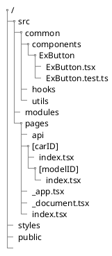

```{.bash .numberLines}
npx create-next-app@latest --ts

npm install prettier --save-dev
npm install eslint-config-prettier --save-dev
npm install @emotion/babel-plugin --save-dev
npm install @emotion/eslint-plugin --save-dev
npm install @typescript-eslint/parser --save-dev
npm install @typescript-eslint/eslint-plugin --save-dev

#Dependencies for MUI
npm install @emotion/react
npm install @emotion/styled

#MUI
npm install @mui/material
npm install @mui/icons-material

#SSR MUI+emotion components
npm install @emotion/server

#auth
npm install --save next-auth
```


```{.json filename=".eslintrc.json"}
{
  "env":{
    "browser": true,
    "es2021": true,
    "node":true
  },
  "parser":"@typescript-eslint/parser",
  "parserOptions":{
    "emcaVersion":2020,
    "sourceType":"module",
    "emcaFeatures":{
      "jsx":true
    },
    "project":"./tsconfig.json"
  },
  "extends": ["next/core-web-vitals","plugin:@typescript-eslint/recommended","prettier"],
  "plugins" : ["@emotion"],
  "rules" : {
    "@emotion/jsx-import" : "error",
    "@emotion/no-vanilla" : "error",
    "@emotion/import-from-emotion" : "error",
    "@emotion/styled-import": "error"
  },
  "settings":{
    "react":{
      "version":"detect"
    }
  }
}
```

```{.json filename=".babelrc"}
{
  "presets" : ["next/babel"],
  "plugins" : ["@emotion"]
}
```
```{.typescript filename="/lib/emotionCache.tsx"}
import createCache from '@emotion/cache';

const createEmotionCache = () => {
  return createCache({ key: 'css' });
};

export default createEmotionCache;
```

```{.typescript filename="/src/components/StyledButton.tsx"}
import styled from '@emotion/styled';

interface IStyleProps{
  backColor: string;
} 

const MyButton = styled.button<IStyleProps>
`
  padding: 100px;
  color: hotpink;
  background-color: ${(props) => props.backColor};
  &:hover {
    color: purple;
   }
`;
const StyledButton = () => {
  return <MyButton backColor="green">hello</MyButton>
};
export default StyledButton;
```


# _document

taken from [Official Nextjs example](https://github.com/mui-org/material-ui/blob/master/examples/nextjs/pages/_document.js)

# _app

taken from [Official Nextjs example](https://github.com/mui-org/material-ui/blob/master/examples/nextjs/pages/_app.js)

 


# File structure determines routing

Page filename in nextjs like "landingpage.js" must be lowercase letters  
React Component filename in nextjs must be Uppercase like "MyCustomButton".



Modules will 

* .next
* package.json
* package-lock.json
* node_modules
* src
  * components
    * MyCustomButton
  * pages
    * [shipID] :: folder => represents a route
      * index.tsx => https://mywebsite.com/[shipID]
      * [modelID].tsx => https://mywebsite.com/[shipID]/[modelID]
    * landingpage.tsx => https://mywebsite.com/landingpage.html
    * index.tsx 
    * _app.tsx :: layout_template
    * _document.tsx :: custom layout_template
    * api :: folder \<IGNORE, it's for backend\>
* styles
 * theme.tsx

# How do you select SSG, PWA, SSR

* Using react hooks means it "may" rerender thus behaving like a PWA
* Using getStaticProp() and never using hooks gives you a static site

Notice how the lines are actually blurred. You can mix and match so the site behaves like an PWA or a static site. 


# Capturing the [carID] and [modelID] as variables

```javascript
import { useRouter } from 'next/router'

export default function Home() {
    const router = useRouter();
    const {myrouteINPUT} = router.query;
    return(<div>
        <h1>hi the text in the url parameter is {myrouteINPUT}
        </h1>
    </div>)
}
```

# ServerSide Render

1. getStaticPath prerenders dynamic routes, basically you tell [car].js to use `{toyota, hyundai}` then we prebuild `toyota.html hyundai.html`
2. getStaticProps fetches data **on build** when `next build` is called. It only runs on server-side.  
The client or window will never see any network call.  
This is NOT like `window.addEventlistener('onload',..)` that fetches data on each client request.  


## 2 types of SSG

| getStaticProps() | getStaticPaths() |
| --- | --- |
| calls on build | calls on first request |

## Why SSG can be bad?


SSG at build time and SSG at first request both are affected by stale data.

* If db changes once, SSG at build time is already stale
* If db changes more than once, SSG at first request becomes stale
This means if more than one update in db we have to rebuild the ENTIRE site.

---

## Solution to Stale SSG - ISR

* Solution ISR which basically means the specific static page ONLY will be rebuilt, 
* If your clientside code auto refreshes every 10 sec, the data will be relatively current. 


# Self is Not Defined

* When importing react Pixi

Reason for error: Pixi library uses 'self' or 'window' which is only defined in the client side. NextJS does prerendering always on the serverside meaning it will run Pixi on the serverside where there is no 'self' or 'window'.

Fix:

1. Use  `import dynamic from 'next/dynamic';`

2. Use useEffect because it only runs on client side


# Exporting as static site

modify package.json for `"export": "next export"`

```bash
npm run build
npm run export
```

build will create an `.next` file that is only useful for servers  
export will create an `out` file containing static files like `index.html`  
All we need are the `out` files  

Errors:  

1. imageOptimisation only works with a server which we dont have. Fis with the experimental turn off image optimization option.
2. Paths are by default **relative**. Nextjs believes `http://server.opnroot.com:5500/` is our root.  We need to modify our paths with assetPrefix and basePath so it points to `http://server.opnroot.com:5500/test1/out` as root. 
    * apparently assetPrefix is js files and css files while basePath is for images and route links

```{.js filename=next.config.js}
/** @type {import('next').NextConfig} */
const { PHASE_DEVELOPMENT_SERVER } = require('next/constants')

module.exports = (phase, { defaultConfig }) => {
  if (phase === PHASE_DEVELOPMENT_SERVER) {
    return {
      /* development only config options here */
      reactStrictMode: true,
      assetPrefix: "",
      basePath: "",
      experimental: {
        images: {
          unoptimized: true,
        },
      }
    }
  }
  return {
    /* config options for all phases except development here */
    reactStrictMode: true,
    assetPrefix: "/out", //static assets are in the /out folder
    basePath: "/out",
    experimental: {
      images: {
        unoptimized: true,
      },
    }
  }
}
```

## Images

Also note that referring to images in *.jsx must be `/vercel.svg`, NOT `./vercel.svg` or `vercel.svg`.  
Example: ` <Image src={"/vercel.svg"} width={50} height={50}></Image>`

## Dynamic Routes DONT work in SSG

* Dynamic routes don't really work but the build still runs 
  * `getStaticPaths()` is used to pregenerate the routes which defeats the whole purpose of "Dynamic" routes.


```{.js filename=pages/[car].js}
import Head from 'next/head'
import { useRouter } from 'next/router' 


export default function Home(props) {
    const {BLEHdata} = props // This is data loaded from getStaticProps
    console.log(BLEHdata)


    const router = useRouter();
    const {myrouteINPUT} = router.query; 
    //NOTICE `myrouteINPUT` is undefined, 
    //since exported static site cant capture dynamic routes
    return(<div>
        <h1>hi
         {myrouteINPUT}
        </h1>
    </div>)
}

//this pregenerates the "dynamic route" for [car].js
//REQUIRED FOR ANY DYNAMIC ROUTE that gets exported as static site.
//clearly this isnt really that dynamic since we have to hardcode this.
export async function getStaticPaths(){
    return{
        paths: [{ params : {car: "1"}}],
        fallback: true,
    }
}

//This is NOT like just calling window.addEventlistener("onload",...)
//This runs on build time, meaning the browser will NEVER see the GET request to the json server.
export async function getStaticProps(){
    const response =await fetch("http://jsonplaceholder.typicode.com/users")
    const BLEHdata = await response.json()
    console.log(BLEHdata) //this will not output on browser but in terminal
    return{
        props: {BLEHdata}
    }
}
```