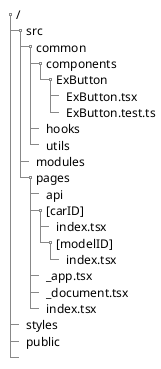

```{.bash .numberLines}
npx create-next-app@latest --ts

npm install prettier --save-dev
npm install eslint-config-prettier --save-dev
npm install @emotion/babel-plugin --save-dev
npm install @emotion/eslint-plugin --save-dev
npm install @typescript-eslint/parser --save-dev
npm install @typescript-eslint/eslint-plugin --save-dev

#Dependencies for MUI
npm install @emotion/react
npm install @emotion/styled

#MUI
npm install @mui/material
npm install @mui/icons-material

#SSR MUI+emotion components
npm install @emotion/server

#auth
npm install --save next-auth
```


```{.json filename=".eslintrc.json"}
{
  "env":{
    "browser": true,
    "es2021": true,
    "node":true
  },
  "parser":"@typescript-eslint/parser",
  "parserOptions":{
    "emcaVersion":2020,
    "sourceType":"module",
    "emcaFeatures":{
      "jsx":true
    },
    "project":"./tsconfig.json"
  },
  "extends": ["next/core-web-vitals","plugin:@typescript-eslint/recommended","prettier"],
  "plugins" : ["@emotion"],
  "rules" : {
    "@emotion/jsx-import" : "error",
    "@emotion/no-vanilla" : "error",
    "@emotion/import-from-emotion" : "error",
    "@emotion/styled-import": "error"
  },
  "settings":{
    "react":{
      "version":"detect"
    }
  }
}
```

```{.json filename=".babelrc"}
{
  "presets" : ["next/babel"],
  "plugins" : ["@emotion"]
}
```
```{.typescript filename="/lib/emotionCache.tsx"}
import createCache from '@emotion/cache';

const createEmotionCache = () => {
  return createCache({ key: 'css' });
};

export default createEmotionCache;
```

```{.typescript filename="/src/components/StyledButton.tsx"}
import styled from '@emotion/styled';

interface IStyleProps{
  backColor: string;
} 

const MyButton = styled.button<IStyleProps>
`
  padding: 100px;
  color: hotpink;
  background-color: ${(props) => props.backColor};
  &:hover {
    color: purple;
   }
`;
const StyledButton = () => {
  return <MyButton backColor="green">hello</MyButton>
};
export default StyledButton;
```


# _document

taken from [Official Nextjs example](https://github.com/mui-org/material-ui/blob/master/examples/nextjs/pages/_document.js)

# _app

taken from [Official Nextjs example](https://github.com/mui-org/material-ui/blob/master/examples/nextjs/pages/_app.js)

 


# File structure determines routing

Page filename in nextjs like "landingpage.js" must be lowercase letters  
React Component filename in nextjs must be Uppercase like "MyCustomButton".



Modules will 

* .next
* package.json
* package-lock.json
* node_modules
* src
  * components
    * MyCustomButton
  * pages
    * [shipID] :: folder => represents a route
      * index.tsx => https://mywebsite.com/[shipID]
      * [modelID].tsx => https://mywebsite.com/[shipID]/[modelID]
    * landingpage.tsx => https://mywebsite.com/landingpage.html
    * index.tsx 
    * _app.tsx :: layout_template
    * _document.tsx :: custom layout_template
    * api :: folder \<IGNORE, it's for backend\>
* styles
 * theme.tsx

# How do you select SSG, PWA, SSR

* Using react hooks means it "may" rerender thus behaving like a PWA
* Using getStaticProp() and never using hooks gives you a static site

Notice how the lines are actually blurred. You can mix and match so the site behaves like an PWA or a static site. 


# Capturing the [carID] and [modelID] as variables

```javascript
const router = useRouter()
const {carID, modelID} = router.query()
console.log(`the car is {carID} and model {modelID}`)
```

# ServerSide Render

## getStaticProps - SSG

* getStaticProps only runs serverside even though you may have written it on a clientside file like index.js
* getStaticProps is only allowed in a page file, NOT in a component file.
* getStaticProps only runs on build time, in dev mode we see it being rebuilt every request which may cause confusion.

### 2 types of SSG

| getStaticProps() | getStaticPaths() |
| --- | --- |
| calls on build | calls on first request |

### Why SSG can be bad?


SSG at build time and SSG at first request both are affected by stale data.

* If db changes once, SSG at build time is already stale
* If db changes more than once, SSG at first request becomes stale
This means if more than one update in db we have to rebuild the ENTIRE site.

---

## Solution to Stale SSG - ISR

* Solution ISR which basically means the specific static page ONLY will be rebuilt, 
* If your clientside code auto refreshes every 10 sec, the data will be relatively current. 


# Self is Not Defined

* When importing react Pixi

Reason for error: Pixi library uses 'self' or 'window' which is only defined in the client side. NextJS does prerendering always on the serverside meaning it will run Pixi on the serverside where there is no 'self' or 'window'.

Fix:

1. Use  `import dynamic from 'next/dynamic';`

2. Use useEffect because it only runs on client side