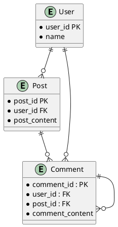

# Strucure

1. Short summary of service
2. Requirements
    * Function
    * Non-functional
    * Extended
3. Capacity Estimation Constraint
    * Storage Est
    * Bandwidth Est
    * High level Est
4. API's /Client-workflow Diagram/design
5. High level Component Design
    * DB Schema
6. Data Partitioning
7. Cache
8. Load balancing
9. Fault Tolerance and Replication

# Post-Comment-Subcomment

