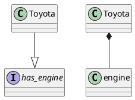
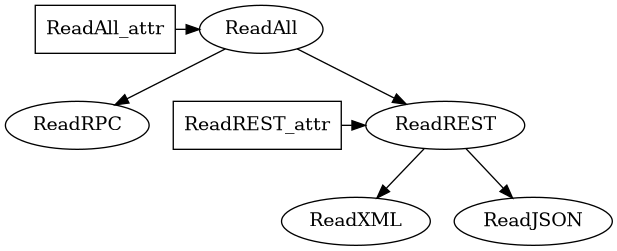

* **Composition can be visualized as a tree**   
* **Composing classes can be thought of as embedding or inserting a class into another class**
  * "Embed a Engine class inside a Car class" == "Insert a Engine class inside a Car class"
  * Golang calls this struct embedding


# AbstractClass/Interface vs Composition

* Inheritance: AbstractClass/Interface are the subset of the group intersection of multiple classes
* Composition: Classes may be composed of the same component which is the group intersection of multiple classes 
* Notice how Composition and Inheritance are basically the same in functionality.





<!--  -->

# Interface Composition

* $f(g(),h(i(),j()))$ 
$f$ is ReadAll and it has it's own type called ReadAll_attr along with composing $g$ and $h(i(),j())$ which are ReadRPC and ReadREST respectively.





```go
type ReadJSON interface {
    ...
}
type ReadXML interface {
    ...
}
type ReadREST interface {
    ReadREST_attr string
    ReadJSON
    ReadXML
}
type ReadRPC interface {
    ...
}
type ReadAll interface{
    ReadAll_attr string
    ReadRPC
    ReadREST
}
```

# Class composition

```go
type Wheel struct {
    ...
}
type Engine struct {

}
type Car struct {
    name string
    Engine
    Wheel
}
```

# Diamond problem

