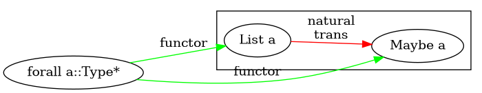
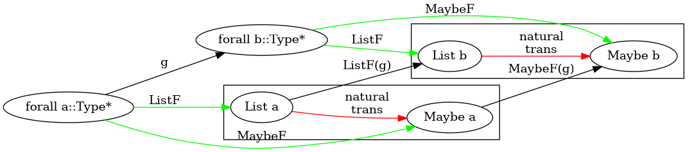
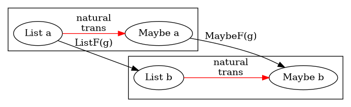

[Category theory with UML](https://tsapps.nist.gov/publication/get_pdf.cfm?pub_id=931719)

| Cat | object | morphism |
| --- | --- | --- |
| Vect | vector space | linear maps |
| Groups | unit | group homomorphisms |
| Mfd(manifolds) | smooth manifolds | Continuous Maps |
| Top | Topological Spaces | Continuous Maps |
| Rel | Sets | Binary relations |
| Meas | Measurable Spaces | measurable maps |
|Par | sets | partial functions |

# Basics

## Isomorphisms

* Set: bijective maps
* Mfd(manifolds):  diffeomorphisms
* Top : homeomorphisms which are invertible continuous map with continuous inverses.

## Monomorphisms

* Set: Injective maps
* Top: Injective continuous maps
* FVect(finite-dimension Vect): injective linear map
* Group: injective group homeomorphisms

## Split monomorphisms

* Set: Every injective function has a left inverse. Therefore every monomorphism is split.
* FVect: Every injective linear map has a left inverse. Therefore every monomorphism is split.

* Top: 

> Generally, monomorphisms are not conceptually related to splits even though it looks the case in Set and FVect. General case is Top

## Epimorphism

* Set: Surjective map
* FVect: Surjective continuous linear map
* Algebra: inclusion
  * Natural number is Included in Integers

## Split Epimorphism


# Functors

## Cocycle

Functors are just 1-cocycles

# Yoneda Embedding Theorem

## Matrix Example

A matrix transformation through row operation is a natural transformation between presheaves.  

Matrix transformation by row operation is isomorphic to a matrix

# PreSheaf

A functor that takes a dual morphism to set category.

$$f^{OP} \Rightarrow Set$$

# Applicative


# Natural

* All functors are endofunctors `functor :: Type* => Type*` wrt to coding
  * `List :: Type* => Type*`
  * `Maybe :: Type* => Type*`

Below is a natural transformation wrt Object a on functors List and Maybe  
Natural Transformation can be considered a family of morphisms between functors wrt an object or morphism.


```hs
g :: ∀a b. a -> b 
naturaltransformation_a :: ∀ a. List a -> Maybe a
```





## Naturality square



# Algebras

3 equivalent ways to define an algebra

$$(\mathbb{N},0::\top \rightarrow \mathbb{N},(+)::\mathbb{N}\times\mathbb{N} \rightarrow \mathbb{N})$$
$$(\mathbb{N},in::\top + \mathbb{N}\times\mathbb{N} \rightarrow \mathbb{N}) \tag{fuse + and 0}$$
$$let\ F X = \top + X \times X \qquad (\mathbb{N}, in::F\ \mathbb{N} \rightarrow \mathbb{N})\tag{package into functor}$$

Other examples of an algebra

* $(\mathbb{B},true::\top \rightarrow \mathbb{B},(\equiv)::\mathbb{B}\times\mathbb{B}\rightarrow\mathbb{B})$
* $(\mathbb{B},false::\top \rightarrow \mathbb{B},(\lor)::\mathbb{B}\times\mathbb{B}\rightarrow\mathbb{B})$

F Algebras are just a set with operations that return values in that set

Inductive datatypes correspond to initial algebras.  
The homomorphisms are catamorphisms or folds.  

